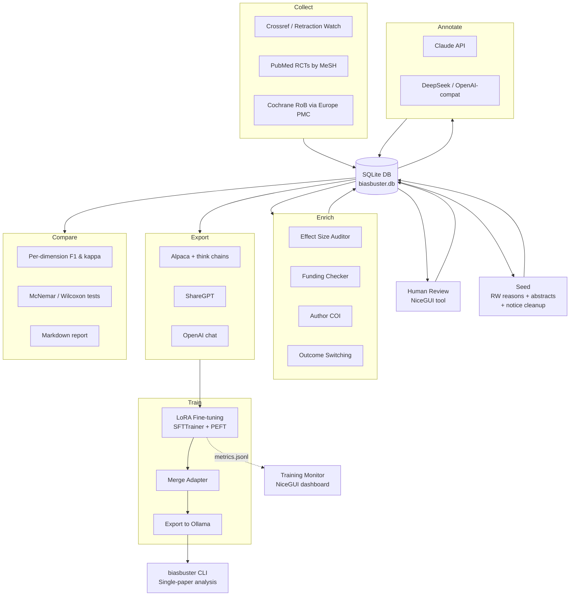

# BiasBuster

A toolkit for building curated training datasets to fine-tune LLMs for detecting
bias in biomedical abstracts, and for evaluating fine-tuned models head-to-head.
Includes a CLI tool for analysing individual publications. Designed for use with
BMLibrarian.

## Quick Start — Analyse a Publication

```bash
# Install
uv sync

# Analyse by PMID
biasbuster 12345678

# Analyse by DOI with markdown report
biasbuster 10.1016/j.example.2024.01.001 --format markdown

# Use a cloud model instead of local Ollama
biasbuster 12345678 --model anthropic:claude-sonnet-4-6

# Analyse a local PDF or JATS XML file
biasbuster ./paper.pdf --format markdown
biasbuster ./paper.xml --model deepseek:deepseek-reasoner

# Full analysis with external verification
biasbuster 12345678 --verify --format markdown
```

See [docs/BIASBUSTER_CLI.md](docs/BIASBUSTER_CLI.md) for full CLI documentation.

## Package Structure

All source code lives under the `biasbuster/` Python package, installable via
`pip install .` or `uv sync`. The package is PyPI-ready with hatchling as the
build backend.

```
biasbuster/                        # Top-level Python package
├── cli/                           # CLI tool for single-publication analysis
│   ├── main.py                    # Entry point (biasbuster command)
│   ├── settings.py                # TOML config loading with env/CLI overrides
│   ├── content.py                 # Identifier resolution, content acquisition via bmlib
│   ├── chunking.py                # Section-based (JATS) + token-window chunking
│   ├── analysis.py                # Single-pass and map-reduce LLM assessment
│   ├── verification.py            # Wrapper around agent verification pipeline
│   ├── formatting.py              # JSON and Markdown output formatters
│   └── pdf_extract.py             # PDF text extraction via pdfplumber
├── agent/                         # Verification agent (tool-augmented assessment)
│   ├── runner.py                  # Agent loop: assess → verify → refine
│   ├── model_client.py            # Ollama API client with retry logic
│   ├── agent_config.py            # Agent configuration dataclass
│   ├── verification_planner.py    # Deterministic verification step synthesis
│   ├── tool_router.py             # Regex-based step → tool call routing
│   └── tools.py                   # Tool wrappers (ClinicalTrials.gov, CMS, ORCID, etc.)
├── collectors/                    # Data source collectors (async)
│   ├── retraction_watch.py        # Retracted papers via Crossref API + PubMed
│   ├── cochrane_rob.py            # Cochrane Risk of Bias assessments
│   ├── pubmed_xml.py              # PubMed XML parsing utilities
│   ├── spin_detector.py           # Heuristic pre-screening for spin indicators
│   └── clinicaltrials_gov.py      # Outcome switching detection via registry
├── enrichers/                     # Heuristic analysis modules
│   ├── effect_size_auditor.py     # Relative vs absolute reporting analysis
│   ├── funding_checker.py         # Funding source classification
│   ├── author_coi.py              # Author conflict-of-interest verification
│   └── retraction_classifier.py   # Retraction reason → severity floor mapping
├── annotators/                    # LLM annotation backends
│   ├── __init__.py                # Shared utilities, JSON repair, retraction filter
│   ├── llm_prelabel.py            # Anthropic Claude annotator
│   └── openai_compat.py           # OpenAI-compatible annotator (DeepSeek, etc.)
├── schemas/
│   └── bias_taxonomy.py           # Structured bias taxonomy and labels
├── evaluation/                    # Model evaluation harness
│   ├── harness.py                 # Inference runner (OpenAI-compatible APIs)
│   ├── scorer.py                  # Output parsing and ground truth attachment
│   ├── metrics.py                 # Per-dimension and aggregate metrics
│   ├── comparison.py              # Statistical comparison + report generation
│   ├── run.py                     # CLI entry point (--model-a / --model-b)
│   └── selftest.py                # Self-test with synthetic data
├── training/                      # LoRA fine-tuning pipeline
│   ├── train_lora.py              # SFTTrainer + PEFT (DGX Spark)
│   ├── train_lora_mlx.py          # MLX LoRA/QLoRA (Apple Silicon)
│   ├── configs.py / configs_mlx.py
│   ├── callbacks.py / callbacks_mlx.py
│   ├── data_utils.py              # Alpaca JSONL loading, chat formatting
│   ├── merge_adapter.py / merge_adapter_mlx.py
│   └── export_to_ollama.sh
├── gui/                           # Fine-Tuning Workbench (NiceGUI)
│   ├── __main__.py                # Entry point: uv run python -m biasbuster.gui
│   ├── app.py                     # 4-tab layout (settings, training, eval, export)
│   ├── state.py                   # Platform detection, settings persistence
│   └── *.py                       # Tab modules
├── utils/                         # Utilities and review tools
│   ├── review_gui.py              # NiceGUI web-based review tool (DB-backed)
│   ├── training_monitor.py        # Real-time training dashboard
│   ├── completeness_checker.py    # Annotation coverage checker
│   └── agreement_analyzer.py      # Inter-model agreement metrics
├── crowd/                         # Crowdsourced human annotation platform
├── database.py                    # SQLite backend (single source of truth)
├── prompts.py                     # Canonical annotation/training prompts
├── pipeline.py                    # Orchestration pipeline (collect→export)
└── export.py                      # Export to fine-tuning formats
```

### Key Dependencies

| Dependency | Purpose |
|------------|---------|
| [bmlib](https://github.com/hherb/bmlib) | Publication retrieval, JATS parsing, LLM abstraction (multi-provider) |
| httpx | Async HTTP client for external APIs |
| anthropic | Anthropic Claude SDK (annotation) |
| pdfplumber | PDF text extraction (CLI tool) |
| nicegui | Web UI for review tool and training workbench |
| tokenizers | Token counting |

### Installation

```bash
# Clone and set up
git clone https://github.com/hherb/biasbuster.git
cd biasbuster
uv sync

# Configure (edit config.py with API keys)
cp config.example.py config.py

# The biasbuster CLI command is now available
biasbuster --help
```

## Bias Taxonomy

The model is trained on a multi-dimensional bias assessment:

1. **Statistical Reporting Bias**
   - Sole/emphasis on relative risk reduction without absolute measures
   - Missing NNT/NNH
   - Baseline risk omission
   - Selective p-value reporting

2. **Spin in Conclusions**
   - Claims not supported by primary outcome
   - Inappropriate causal language from observational data
   - Focus on secondary/subgroup analyses when primary failed
   - Boutron classification: none/low/moderate/high

3. **Outcome Reporting**
   - Surrogate vs patient-centred outcomes
   - Outcome switching (vs registry)
   - Composite endpoint disaggregation missing

4. **Conflict of Interest Signals**
   - Industry funding without disclosure
   - Author-pharma payment patterns
   - Ghost authorship indicators

5. **Methodological Red Flags**
   - Inappropriate comparator (placebo when active exists)
   - Enrichment design without acknowledgment
   - Per-protocol only (no ITT)
   - Premature stopping

## BiasBuster CLI

The `biasbuster` command analyses individual publications for risk of bias.
It accepts PMIDs, DOIs, or local files and produces structured JSON or Markdown
reports.

### How It Works

1. **Content acquisition** — fetches full text via bmlib's 3-tier fallback chain
   (Europe PMC JATS XML → Unpaywall PDF → abstract-only fallback)
2. **JATS back-matter extraction** — extracts funding, COI disclosures, and
   acknowledgments from `<back>` elements that standard body parsers miss
3. **Analysis** — for abstracts: single-pass LLM assessment; for full text:
   map-reduce (per-section analysis → synthesis into unified 5-domain assessment)
4. **Verification** (optional, `--verify`) — cross-checks against ClinicalTrials.gov,
   CMS Open Payments, ORCID, Europe PMC, Retraction Watch
5. **Output** — JSON (default) or Markdown report

### Model Selection

Models use bmlib's `provider:model_name` format:

```bash
biasbuster 12345678 --model ollama:qwen3.5-9b-biasbuster  # local fine-tuned
biasbuster 12345678 --model anthropic:claude-sonnet-4-6    # Anthropic API
biasbuster 12345678 --model deepseek:deepseek-reasoner     # DeepSeek API
biasbuster 12345678 --model gpt-oss:20b                    # Ollama (auto-detected)
```

Bare model names without a known provider prefix (e.g. `gpt-oss:20b`) default to
Ollama. Known providers: anthropic, ollama, openai, deepseek, mistral, gemini.

### Download Caching

Downloaded abstracts and full-text files are cached in `~/.biasbuster/downloads/`
so repeated analyses of the same paper skip network calls. Use `--force-download`
to re-fetch after a correction or retraction.

### Configuration

Settings are read from `~/.biasbuster/config.toml` with environment variable and
CLI flag overrides. See [docs/BIASBUSTER_CLI.md](docs/BIASBUSTER_CLI.md) for the
full config reference.

## Dataset Building Pipeline

```bash
# Run full pipeline (collect → seed → enrich → annotate → export)
uv run python -m biasbuster.pipeline --stage all

# Or run individual stages
uv run python -m biasbuster.pipeline --stage collect
uv run python -m biasbuster.pipeline --stage seed
uv run python -m biasbuster.pipeline --stage enrich
uv run python -m biasbuster.pipeline --stage annotate
uv run python -m biasbuster.pipeline --stage annotate --models anthropic,deepseek
uv run python -m biasbuster.pipeline --stage export
uv run python -m biasbuster.pipeline --stage compare
```

### Single-Paper Import & Annotation

```bash
uv run python -m biasbuster.annotate_single_paper --pmid 41271640
uv run python -m biasbuster.annotate_single_paper --pmid 41271640 --model anthropic
uv run python -m biasbuster.annotate_single_paper --doi 10.1016/j.example.2024.01.001
uv run python -m biasbuster.annotate_single_paper --pmid 41271640 --force
```

### Data Storage

All pipeline data is stored in a single SQLite database (`dataset/biasbuster.db`).

| Table | Purpose | Key |
|-------|---------|-----|
| `papers` | Collected papers with RoB domain ratings, review metadata | `pmid` |
| `enrichments` | Heuristic analysis results (effect size audit, outcome switching) | `pmid` |
| `annotations` | LLM bias assessments (one row per paper per model) | `(pmid, model_name)` |
| `human_reviews` | Human validation decisions | `(pmid, model_name)` |
| `eval_outputs` | Evaluation harness results | `(pmid, model_id, mode)` |

### Pipeline Flow



## Retracted Papers Strategy

- **Retraction notices** (bare "This article has been retracted" text) are
  **filtered out** by `is_retraction_notice()`. They have no assessable content.
- **Original papers that were later retracted** are high-value training examples.
  The collector follows the Crossref `update-to` relationship back to the
  original DOI and fetches the original abstract from PubMed.

## Verification Sources

The model learns WHERE to look for corroboration:

- **CMS Open Payments** (openpaymentsdata.cms.gov) — US physician payments
- **ClinicalTrials.gov** — Registered outcomes vs published outcomes
- **ORCID** — Author affiliation history
- **Europe PMC** — Funder metadata, full-text COI sections
- **Crossref / Retraction Watch** — Retraction status
- **Cochrane RoB database** — Expert risk assessments

## Dataset Utilities

### Completeness Checker

```bash
uv run python -m biasbuster.utils.completeness_checker
uv run python -m biasbuster.utils.completeness_checker --no-limits
```

### Inter-Model Agreement Analyzer

```bash
uv run python -m biasbuster.utils.agreement_analyzer
uv run python -m biasbuster.utils.agreement_analyzer --model-a anthropic --model-b deepseek
```

### Review GUI

```bash
uv run python -m biasbuster.utils.review_gui --model anthropic
```

## Fine-Tuning Workbench (GUI)

```bash
uv run python -m biasbuster.gui
uv run python -m biasbuster.gui --port 9090
```

4-tab NiceGUI application: Settings → Training (live charts) → Evaluation → Export.

## Fine-Tuning (LoRA)

```bash
# Train (DGX Spark)
./run_training.sh qwen3.5-27b

# Train (Apple Silicon)
./run_training_mlx.sh qwen3.5-27b-4bit

# One-command train → merge → Ollama → evaluate
./train_and_evaluate.sh gpt-oss-20b
```

### Training Monitor

```bash
uv run python -m biasbuster.utils.training_monitor
```

## Evaluation Harness

```bash
# Self-test
uv run python -m biasbuster.evaluation.selftest

# Compare two models
uv run python -m biasbuster.evaluation.run \
    --test-set dataset/export/alpaca/test.jsonl \
    --model-a qwen3.5-27b-biasbuster --endpoint-a http://localhost:11434 \
    --model-b gpt-oss-20b-biasbuster --endpoint-b http://localhost:11434 \
    --mode fine-tuned --sequential --num-ctx 4096 \
    --output eval_results/fine_tuned/
```

## Documentation

- [CLI Reference](docs/BIASBUSTER_CLI.md) — full `biasbuster` command documentation
- [User Manual](docs/manual/index.md) — step-by-step guide through the entire pipeline
- [Training Guide](docs/TRAINING.md) — LoRA fine-tuning details
- [MLX Training](docs/MLX_TRAINING.md) — Apple Silicon training guide
- [Model Card](docs/MODEL_CARD.md) — fine-tuned model documentation
