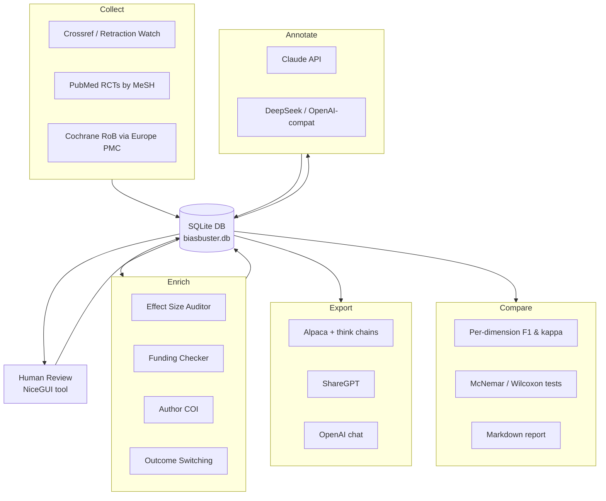

# BMLibrarian Bias Detection Dataset Builder

A toolkit for building curated training datasets to fine-tune LLMs for detecting
bias in biomedical abstracts, and for evaluating fine-tuned models head-to-head.
Designed for use with BMLibrarian.

## Architecture

```
bias_dataset_builder/
├── collectors/
│   ├── retraction_watch.py    # Retracted papers via Crossref API
│   ├── cochrane_rob.py        # Cochrane Risk of Bias assessments
│   ├── spin_detector.py       # Heuristic pre-screening for spin indicators
│   └── clinicaltrials_gov.py  # Outcome switching detection via registry
├── enrichers/
│   ├── author_coi.py          # Author conflict-of-interest verification
│   ├── funding_checker.py     # Funding source classification
│   └── effect_size_auditor.py # Relative vs absolute reporting analysis
├── annotators/
│   ├── __init__.py            # Shared utilities, retraction notice filter
│   ├── llm_prelabel.py        # Anthropic Claude annotator
│   └── openai_compat.py       # OpenAI-compatible annotator (DeepSeek, etc.)
├── schemas/
│   └── bias_taxonomy.py       # Structured bias taxonomy and labels
├── evaluation/
│   ├── harness.py             # Inference runner (OpenAI-compatible APIs)
│   ├── scorer.py              # Output parsing and ground truth attachment
│   ├── metrics.py             # Per-dimension and aggregate metrics
│   ├── comparison.py          # Statistical comparison + report generation (JSON/MD/CSV)
│   ├── run.py                 # CLI entry point (--model-a / --model-b)
│   └── selftest.py            # Self-test with synthetic data
├── utils/
│   ├── completeness_checker.py # Check labelling coverage per model
│   ├── agreement_analyzer.py   # Inter-model agreement metrics
│   └── review_gui.py           # NiceGUI web-based review tool (DB-backed)
├── database.py                # SQLite backend (single source of truth)
├── migrate_jsonl_to_sqlite.py # Idempotent JSONL → SQLite migration script
├── config.py                  # Configuration and API keys
├── pipeline.py                # Orchestration pipeline
└── export.py                  # Export to fine-tuning formats (Alpaca, ShareGPT)
```

## Bias Taxonomy

The model is trained on a multi-dimensional bias assessment:

1. **Statistical Reporting Bias**
   - Sole/emphasis on relative risk reduction without absolute measures
   - Missing NNT/NNH
   - Baseline risk omission
   - Selective p-value reporting

2. **Spin in Conclusions**
   - Claims not supported by primary outcome
   - Inappropriate causal language from observational data
   - Focus on secondary/subgroup analyses when primary failed
   - Boutron classification: none/low/moderate/high

3. **Outcome Reporting**
   - Surrogate vs patient-centred outcomes
   - Outcome switching (vs registry)
   - Composite endpoint disaggregation missing

4. **Conflict of Interest Signals**
   - Industry funding without disclosure
   - Author-pharma payment patterns
   - Ghost authorship indicators

5. **Methodological Red Flags**
   - Inappropriate comparator (placebo when active exists)
   - Enrichment design without acknowledgment
   - Per-protocol only (no ITT)
   - Premature stopping

## Retracted Papers Strategy

Retracted papers are handled in two distinct ways:

- **Retraction notices** (bare "This article has been retracted" text with no
  original research content) are **filtered out** before annotation. The
  `is_retraction_notice()` function in `annotators/__init__.py` detects these
  by title/abstract patterns and length heuristics. They have no assessable
  content for bias detection.

- **Original papers that were later retracted** are high-value training examples.
  Their flaws were serious enough to warrant retraction, making them excellent
  ground truth for bias assessment. The retraction watch collector follows the
  Crossref `update-to` relationship from retraction notices back to the original
  paper's DOI and fetches the original abstract from PubMed.

The annotation system prompt (principle 5 in `ANNOTATION_SYSTEM_PROMPT`) instructs
models to assess retracted papers on their actual content rather than
automatically assigning "critical" severity based on retraction status alone.

## Annotation Prompt — Operational Definitions

The annotation system prompt in `annotators/llm_prelabel.py` includes detailed
operational definitions (principles 5–9) that resolve ambiguities causing
inter-model disagreement:

| Principle | Topic | Key Clarification |
|-----------|-------|-------------------|
| 5 | Retraction notices | Bare notices → skip; original content with retraction metadata → assess normally |
| 6 | Absolute vs relative | Raw event rates in both arms (e.g. "84% vs 36%") count as absolute measures |
| 7 | Surrogate vs patient-centred | Process measures (dose modifications, lab values) are surrogates; mortality/QoL/functional status are patient-centred |
| 8 | Methodology thresholds | Domain-specific follow-up adequacy cutoffs (e.g. <12 months for chronic disease = short) |
| 9 | COI disclosure | Funding source alone is insufficient for `coi_disclosed = true`; requires explicit author-level COI statements |

These definitions were added after observing ~55% disagreement between Claude and
DeepSeek on 898 shared annotations, driven primarily by ambiguous handling of
retraction notices, relative/absolute measure classification, and methodology
severity thresholds.

## Verification Sources (for model training)

The model should learn WHERE to look for corroboration:

- **CMS Open Payments** (openpaymentsdata.cms.gov) - US physician payments
- **ClinicalTrials.gov** - Registered outcomes vs published outcomes
- **WHO ICTRP** - International trial registry search
- **Crossref/Retraction Watch** - Retraction status
- **ORCID** - Author affiliation history
- **EuroPMC funding data** - Funder metadata
- **Cochrane RoB database** - Expert risk assessments

## Usage

### Dataset Building Pipeline

```bash
# Set up environment and install dependencies
uv sync

# Configure
cp config.example.py config.py
# Edit config.py with your API keys

# Run full pipeline (collect → enrich → annotate → export)
uv run python pipeline.py --stage all

# Or run individual stages
uv run python pipeline.py --stage collect
uv run python pipeline.py --stage enrich
uv run python pipeline.py --stage annotate
uv run python pipeline.py --stage export
```

### Data Storage

All pipeline data is stored in a single SQLite database (`dataset/biasbuster.db`
by default). The schema has four tables:

| Table | Purpose | Key |
|-------|---------|-----|
| `papers` | All collected papers (retracted, RCT, Cochrane) | `pmid` |
| `enrichments` | Heuristic analysis results (effect size audit, outcome switching) | `pmid` |
| `annotations` | LLM bias assessments (one row per paper per model) | `(pmid, model_name)` |
| `human_reviews` | Human validation decisions | `(pmid, model_name)` |

This replaces the previous JSONL file-based layout. If you have existing JSONL
data, run the migration script:

```bash
uv run python migrate_jsonl_to_sqlite.py
uv run python migrate_jsonl_to_sqlite.py --data-dir dataset --db-path dataset/biasbuster.db
```

### Pipeline Flow



Human review (using the NiceGUI web tool) is a manual step between annotate and export.

## Dataset Utilities

Three tools support the human-review workflow between annotation and export.
All read from and write to the SQLite database.

### Completeness Checker

Reports annotation coverage — how many available abstracts each model has
annotated, with progress against configured limits.

```bash
# Show completion against configured annotation limits
uv run python -m utils.completeness_checker

# Show progress against full available set (ignore config caps)
uv run python -m utils.completeness_checker --no-limits

# Check specific models only
uv run python -m utils.completeness_checker --models anthropic,deepseek

# Use a specific database
uv run python -m utils.completeness_checker --db-path dataset/biasbuster.db
```

Example output (default: shows progress vs configured caps):

```
Source                    |            anthropic |             deepseek
-----------------------------------------------------------------------
cochrane_rob              |     6/6     (100.0%) |     6/6     (100.0%)
high_suspicion            |   393/394   ( 99.7%) |   394/394   (100.0%)
low_suspicion             |   300/300   (100.0%) |   300/300   (100.0%)  [of 2733 available]
retracted_papers          |   199/200   ( 99.5%) |   200/200   (100.0%)  [of 514 available]
-----------------------------------------------------------------------
TOTAL                     |   898/900   ( 99.8%) |   900/900   (100.0%)
```

### Inter-Model Agreement Analyzer

Compares two models' annotations on shared PMIDs — per-dimension severity
agreement, Cohen's weighted kappa, flag-level agreement, and the most divergent
cases. Lighter-weight than the full evaluation pipeline (no ground truth needed).

```bash
# Default: compare anthropic vs deepseek
uv run python -m utils.agreement_analyzer

# Specify models and save report
uv run python -m utils.agreement_analyzer --model-a anthropic --model-b deepseek --output report.md

# Show more divergent cases
uv run python -m utils.agreement_analyzer --top-divergent 20

# Use a specific database
uv run python -m utils.agreement_analyzer --db-path dataset/biasbuster.db
```

Reports overall severity kappa, per-dimension exact/within-one agreement,
flag-level agreement rates (e.g. `relative_only`, `spin_level`, `funding_type`),
probability MAE and Pearson r, and the top most-divergent cases ranked by
bias probability difference.

### Review GUI

Web-based tool for reviewing and validating annotations. Reads from and saves
directly to the SQLite database. Opens in your browser with an editable AG Grid
table. Built with NiceGUI.

```bash
# Review a specific model's annotations
uv run python -m utils.review_gui --model anthropic

# Browse available models interactively
uv run python -m utils.review_gui

# Use a different port or database
uv run python -m utils.review_gui --model deepseek --port 9090 --db-path dataset/biasbuster.db
```

Features:
- **In-grid editing** of `HUMAN_VALIDATED`, `HUMAN_OVERRIDE_SEVERITY`, and
  `HUMAN_NOTES` columns (double-click to edit)
- **Color-coded rows**: green for validated, yellow for overridden severity
- **Quick filter** and column sorting
- **"Next Unvalidated"** button to jump to the next unreviewed row
- **Detail panel** showing full reasoning text on row selection
- **Export CSV** button for offline review in spreadsheets
- **Direct DB save** — changes are written to the `human_reviews` table
- **Stats bar** showing validation progress

## Fine-Tuning (LoRA)

The `training/` module fine-tunes candidate base models using LoRA adapters.
Training runs inside the NGC PyTorch container on DGX Spark (the only source of
aarch64 + CUDA PyTorch). Both models use identical LoRA hyperparameters for a
controlled comparison — only the base model differs.

### Quick Start

```bash
# 1. Train (each takes ~2-4 hours on DGX Spark)
./run_training.sh qwen3.5-27b
./run_training.sh olmo-3.1-32b

# 2. Merge LoRA adapter into base model
./run_merge.sh qwen3.5-27b
./run_merge.sh olmo-3.1-32b

# 3. Export to Ollama (safetensors — full precision)
bash training/export_to_ollama.sh training_output/qwen3.5-27b-merged qwen3.5-27b-biasbuster
bash training/export_to_ollama.sh training_output/olmo-3.1-32b-merged olmo-3.1-32b-biasbuster

# 3b. Or export as quantized GGUF (smaller, faster inference)
bash training/export_to_ollama.sh training_output/qwen3.5-27b-merged qwen3.5-27b-biasbuster-q4 --gguf Q4_K_M

# 4. Evaluate fine-tuned models
uv run python -m evaluation.run \
    --test-set dataset/export/alpaca/test.jsonl \
    --model-a qwen3.5-27b-biasbuster --endpoint-a http://localhost:11434 \
    --model-b olmo-3.1-32b-biasbuster --endpoint-b http://localhost:11434 \
    --mode fine-tuned --sequential --num-ctx 4096 \
    --output eval_results/fine_tuned/
```

### Smoke Test

Run 5 training steps to verify the setup without waiting hours:

```bash
./run_training.sh qwen3.5-27b --max-steps 5
```

### Checkpoint/Resume

Training saves checkpoints every 50 steps. To resume after interruption:

```bash
./run_training.sh qwen3.5-27b --resume
```

### LoRA Configuration (Controlled Comparison)

| Parameter | Value |
|---|---|
| LoRA rank | 16 |
| LoRA alpha | 32 |
| Target modules | q,k,v,o_proj + gate,up,down_proj |
| Learning rate | 2e-4 (cosine schedule) |
| Effective batch size | 4 (1 × 4 grad accum) |
| Epochs | 3 |
| Precision | bf16 (no quantization) |
| Max sequence length | 4096 |

## Evaluation Harness

The `evaluation/` module provides a standardised framework for comparing
fine-tuned bias detection models. It supports zero-shot baselines and
post-fine-tuning evaluation, producing per-dimension metrics and head-to-head
statistical comparisons.

### Motivation: Dual-Model Comparison

The evaluation harness was built to rigorously compare candidate base models for
fine-tuning — specifically **OLMo 3.1 32B** and **Qwen3.5 27B**. These models
represent two distinct approaches:

| | OLMo 3.1 32B | Qwen3.5 27B |
|---|---|---|
| **Training data** | Fully open (Dolma 3: 238M academic PDFs, Semantic Scholar corpus) | Closed, large-scale multilingual |
| **Biomedical strength** | Heavy academic/scientific bias in pretraining data | Broader general coverage |
| **Transparency** | Full: data, code, checkpoints, intermediate weights all public | Model weights only |
| **Context window** | ~32K–128K | 262K native |
| **Modality** | Text only | Multimodal (text, images, video) |
| **Fine-tuning** | SFT and DPO checkpoints released separately | Standard instruct checkpoint |
| **Parameters** | 32B (~64GB bf16) | 27B (~54GB bf16) |

For a research integrity tool, OLMo's full transparency and academic-heavy
training data are compelling — you can audit what the model was trained on and
cite it in publications. Qwen3.5 likely has stronger raw benchmark performance
and offers multimodality if table/figure analysis is needed later.

The evaluation harness lets you answer empirically which model performs better on
*this specific task* rather than relying on general benchmarks.

### Evaluation Pipeline

```
Test Examples (JSONL with ground truth)
    │
    ▼
EvalHarness — query models via OpenAI-compatible API (SGLang, vLLM, Ollama)
    │
    ▼
scorer.py — parse outputs (JSON or free-text), extract <think> reasoning
    │
    ▼
metrics.py — per-dimension binary F1, ordinal kappa, flag accuracy, calibration
    │
    ▼
comparison.py — McNemar (binary) and Wilcoxon (ordinal) pairwise tests
    │
    ▼
Reports — JSON + Markdown with confusion matrices, radar data, winner summary
```

### What the Reports Measure

- **Per-dimension F1 and weighted kappa** — separately for statistical reporting,
  spin, COI, outcome reporting, and methodology. Shows which model handles
  specific bias types best.
- **Severity confusion matrices** — reveals whether a model systematically
  under-rates or over-rates bias severity.
- **Flag-level accuracy** — binary accuracy on specific flags like
  `relative_only`, `nnt_reported`, `baseline_risk_reported`.
- **Verification source coverage** — what percentage of the time each model
  recommends checking Open Payments, ClinicalTrials.gov, ORCID, etc.
- **Calibration** — whether the model's bias probability estimates match observed
  rates (Expected Calibration Error).
- **Reasoning quality** — `<think>` block presence and length for reasoning
  models.
- **Statistical significance** — McNemar's test (binary detection) and Wilcoxon
  signed-rank (ordinal severity) determine whether differences are real.

### Running Evaluations

**Self-test** (no model endpoints needed — validates the scoring pipeline):

```bash
uv run python -m evaluation.selftest
```

**Serve models** (example with SGLang on a DGX Spark):

```bash
# Terminal 1: Qwen3.5-27B
python -m sglang.launch_server --model-path Qwen/Qwen3.5-27B \
    --port 8000 --reasoning-parser qwen3

# Terminal 2: OLMo-3.1-32B (run sequentially if memory-constrained)
python -m sglang.launch_server --model-path allenai/Olmo-3.1-32B-Instruct \
    --port 8001
```

**Zero-shot baseline** (before any fine-tuning):

```bash
uv run python -m evaluation.run \
    --test-set dataset/export/alpaca/test.jsonl \
    --model-a qwen3.5-27b --endpoint-a http://localhost:8000 \
    --model-b olmo-3.1-32b --endpoint-b http://localhost:8001 \
    --mode zero-shot \
    --output eval_results/zero_shot/
```

**Post-fine-tuning evaluation** (same test set, LoRA-adapted models):

```bash
uv run python -m evaluation.run \
    --test-set dataset/export/alpaca/test.jsonl \
    --model-a qwen3.5-27b-lora --endpoint-a http://localhost:8000 \
    --model-b olmo-3.1-32b-lora --endpoint-b http://localhost:8001 \
    --mode fine-tuned \
    --output eval_results/finetuned/
```

**Re-score saved outputs** (no inference needed):

```bash
uv run python -m evaluation.run \
    --test-set dataset/export/alpaca/test.jsonl \
    --reanalyse eval_results/zero_shot/ \
    --output eval_results/zero_shot_rescored/
```

### Controlled Comparison Protocol

For a rigorous head-to-head, keep these variables identical across models:

- LoRA rank, alpha, target modules, learning rate, batch size, epochs
- Temperature, max tokens, top-p at inference time
- Test set (10% held out, never seen during training)

The only variable that should differ is the base model. Evaluate each bias
dimension separately — one model might excel at relative-vs-absolute detection
while the other is better at spin classification.

The **zero-shot baseline** (before fine-tuning) is particularly informative: it
measures how much each model already knows about bias detection from pretraining
alone. If OLMo outperforms Qwen on bias detection zero-shot despite weaker
general benchmarks, that directly demonstrates the value of Dolma's
academic-heavy training corpus.
