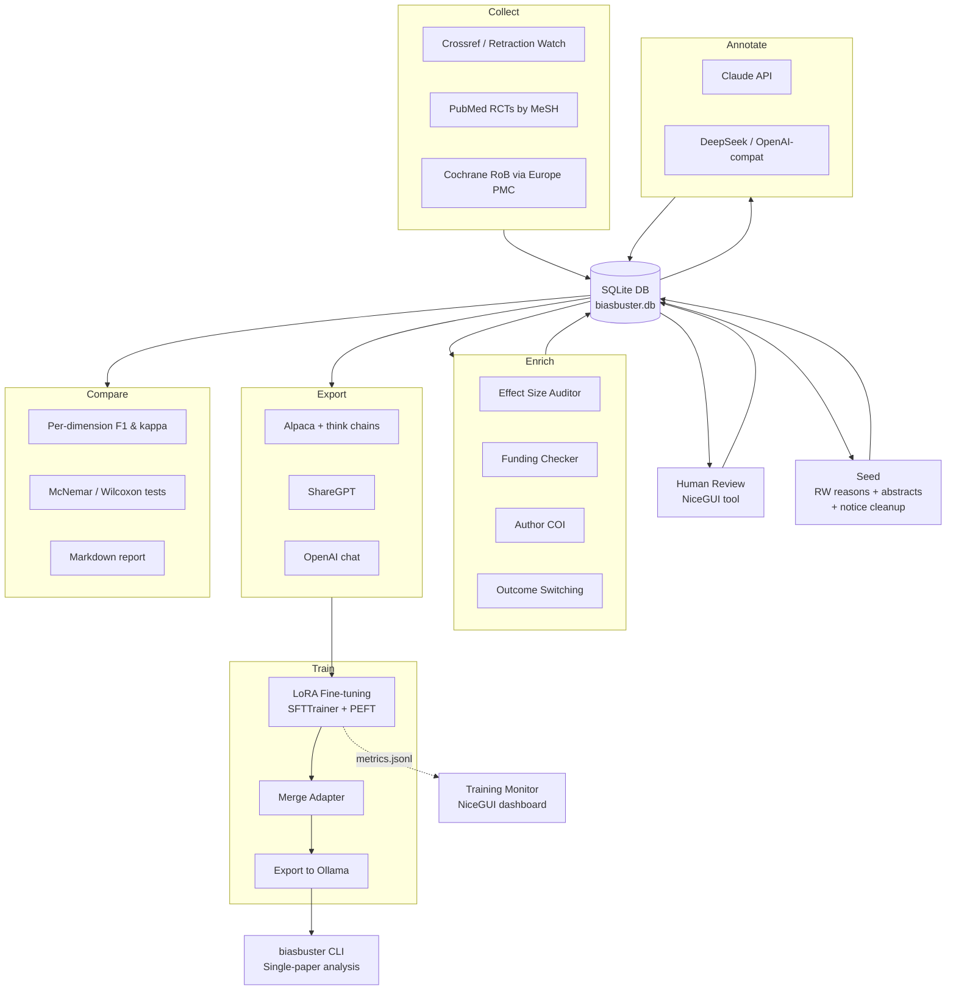

# BiasBuster

**A risk-of-bias analysis pipeline for biomedical randomised trials.**
Reads a paper's full text (or abstract if full text isn't available),
extracts structured facts with one LLM call, assesses bias across
5 domains with a second LLM call, and produces a JSON or Markdown
report with specific verification steps pointing at external databases
(ClinicalTrials.gov, CMS Open Payments, ORCID, etc.). Ships with a CLI
tool, the analysis library, a dataset-building pipeline, optional
LoRA fine-tuning infrastructure, and a GUI workbench. Designed for use
with BMLibrarian.

**BiasBuster assesses *risk of bias*, not *proof of bias*** — and is
intentionally more aggressive than Cochrane RoB 2 on the Conflict of
Interest domain, which Cochrane deliberately excludes. See
[COI Design Rationale](docs/two_step_approach/DESIGN_RATIONALE_COI.md)
for the full justification.

## Project Status (April 2026)

**The v3 two-call pipeline with Round 10 prompts is the current
recommended production path.** Ten rounds of prompt engineering on a
split extraction-then-assessment architecture produced local-model
results that match Claude's full-text annotation on the project's
motivating failure case (PMID 41750436, Seed Health synbiotic RCT):

| Local model (v3 full-text two-call) | Match to Claude GT |
|---|---|
| **gemma4 26B** (a4b-it-q8_0) | **9/9 reliability runs match Claude exactly** on every per-flag value AND on `overall_bias_probability` to two decimal places |
| gpt-oss 20B | 3/3 flags match with one run over-escalating to `critical` (in the correct direction on a HIGH paper) |
| gpt-oss 120B | 3/3 flags match, one run in the 1/3 per-arm extraction noise band |

**This changes the project's positioning.** The original goal was to
build training data and fine-tune a dedicated model. The v3 pipeline
with a well-prompted 26B open-weight model now reaches Claude-equivalent
output on the failure case that motivated the rebuild. Fine-tuning is
**still supported** via the LoRA infrastructure below, but it is now
an **optional cost/latency optimisation**, not a necessity for
quality. If you want to analyse papers and can run Ollama with a
~26B model, try the v3 pipeline first — you probably don't need to
fine-tune anything.

Full empirical history, including the iteration loop, reliability
tests, and ongoing multi-paper calibration:
[docs/two_step_approach/INITIAL_FINDINGS_V3.md](docs/two_step_approach/INITIAL_FINDINGS_V3.md).

## Quick Start — Analyse a Publication

```bash
# Install
uv sync

# Pull the recommended local model (once, ~18 GB on disk)
ollama pull gemma4:26b-a4b-it-q8_0

# Analyse by PMID with the recommended local model
biasbuster 12345678 --model ollama:gemma4:26b-a4b-it-q8_0

# Analyse by DOI with markdown report
biasbuster 10.1016/j.example.2024.01.001 \
    --model ollama:gemma4:26b-a4b-it-q8_0 \
    --format markdown

# Cloud fallback when you want the strongest available model
biasbuster 12345678 --model anthropic:claude-sonnet-4-6

# Analyse a local PDF or JATS XML file
biasbuster ./paper.pdf --format markdown --model ollama:gemma4:26b-a4b-it-q8_0
biasbuster ./paper.xml --model deepseek:deepseek-reasoner

# Save markdown report to a file
biasbuster 12345678 --model ollama:gemma4:26b-a4b-it-q8_0 --format markdown -o report.md

# Full analysis with external verification (ClinicalTrials.gov, CMS, ORCID, etc.)
biasbuster 12345678 --model ollama:gemma4:26b-a4b-it-q8_0 --verify --format markdown
```

See [docs/BIASBUSTER_CLI.md](docs/BIASBUSTER_CLI.md) for full CLI
documentation.

> **On the default model**: for historical reasons the CLI's built-in
> `DEFAULT_MODEL` still points at a legacy fine-tuned alias
> (`ollama:qwen3.5-9b-biasbuster`) produced by this project's earlier
> training pipeline. If you haven't fine-tuned that model yourself,
> pass `--model ollama:gemma4:26b-a4b-it-q8_0` (or any other model
> of your choice) explicitly, or set `model.default` in
> `~/.biasbuster/config.toml`.

## Package Structure

All source code lives under the `biasbuster/` Python package, installable via
`pip install .` or `uv sync`. The package is PyPI-ready with hatchling as the
build backend.

```
biasbuster/                        # Top-level Python package
├── cli/                           # CLI tool for single-publication analysis
│   ├── main.py                    # Entry point (biasbuster command)
│   ├── settings.py                # TOML config loading with env/CLI overrides
│   ├── content.py                 # Identifier resolution, content acquisition via bmlib
│   ├── chunking.py                # Section-based (JATS) + token-window chunking
│   ├── analysis.py                # Single-pass and map-reduce LLM assessment
│   ├── verification.py            # Wrapper around agent verification pipeline
│   ├── formatting.py              # JSON and Markdown output formatters
│   └── pdf_extract.py             # PDF text extraction via pdfplumber
├── agent/                         # Verification agent (tool-augmented assessment)
│   ├── runner.py                  # Agent loop: assess → verify → refine
│   ├── model_client.py            # Ollama API client with retry logic
│   ├── agent_config.py            # Agent configuration dataclass
│   ├── verification_planner.py    # Deterministic verification step synthesis
│   ├── tool_router.py             # Regex-based step → tool call routing
│   └── tools.py                   # Tool wrappers (ClinicalTrials.gov, CMS, ORCID, etc.)
├── collectors/                    # Data source collectors (async)
│   ├── retraction_watch.py        # Retracted papers via Crossref API + PubMed
│   ├── cochrane_rob.py            # Cochrane Risk of Bias assessments
│   ├── pubmed_xml.py              # PubMed XML parsing utilities
│   ├── spin_detector.py           # Heuristic pre-screening for spin indicators
│   └── clinicaltrials_gov.py      # Outcome switching detection via registry
├── enrichers/                     # Heuristic analysis modules
│   ├── effect_size_auditor.py     # Relative vs absolute reporting analysis
│   ├── funding_checker.py         # Funding source classification
│   ├── author_coi.py              # Author conflict-of-interest verification
│   └── retraction_classifier.py   # Retraction reason → severity floor mapping
├── annotators/                    # LLM annotation backends
│   ├── __init__.py                # Shared utilities, JSON repair, retraction filter
│   ├── llm_prelabel.py            # Anthropic Claude annotator
│   └── openai_compat.py           # OpenAI-compatible annotator (DeepSeek, etc.)
├── schemas/
│   └── bias_taxonomy.py           # Structured bias taxonomy and labels
├── evaluation/                    # Model evaluation harness
│   ├── harness.py                 # Inference runner (OpenAI-compatible APIs)
│   ├── scorer.py                  # Output parsing and ground truth attachment
│   ├── metrics.py                 # Per-dimension and aggregate metrics
│   ├── comparison.py              # Statistical comparison + report generation
│   ├── run.py                     # CLI entry point (--model-a / --model-b)
│   └── selftest.py                # Self-test with synthetic data
├── training/                      # LoRA fine-tuning pipeline
│   ├── train_lora.py              # SFTTrainer + PEFT (DGX Spark)
│   ├── train_lora_mlx.py          # MLX LoRA/QLoRA (Apple Silicon)
│   ├── configs.py / configs_mlx.py
│   ├── callbacks.py / callbacks_mlx.py
│   ├── data_utils.py              # Alpaca JSONL loading, chat formatting
│   ├── merge_adapter.py / merge_adapter_mlx.py
│   └── export_to_ollama.sh
├── gui/                           # Fine-Tuning Workbench (NiceGUI)
│   ├── __main__.py                # Entry point: uv run python -m biasbuster.gui
│   ├── app.py                     # 4-tab layout (settings, training, eval, export)
│   ├── state.py                   # Platform detection, settings persistence
│   └── *.py                       # Tab modules
├── utils/                         # Utilities and review tools
│   ├── review_gui.py              # NiceGUI web-based review tool (DB-backed)
│   ├── training_monitor.py        # Real-time training dashboard
│   ├── completeness_checker.py    # Annotation coverage checker
│   └── agreement_analyzer.py      # Inter-model agreement metrics
├── crowd/                         # Crowdsourced human annotation platform
├── database.py                    # SQLite backend (single source of truth)
├── prompts.py                     # Canonical annotation/training prompts
├── pipeline.py                    # Orchestration pipeline (collect→export)
└── export.py                      # Export to fine-tuning formats
```

### Key Dependencies

| Dependency | Purpose |
|------------|---------|
| [bmlib](https://github.com/hherb/bmlib) | Publication retrieval, JATS parsing, LLM abstraction (multi-provider) |
| httpx | Async HTTP client for external APIs |
| anthropic | Anthropic Claude SDK (annotation) |
| pdfplumber | PDF text extraction (CLI tool) |
| nicegui | Web UI for review tool and training workbench |
| tokenizers | Token counting |

### Installation

```bash
# Clone and set up
git clone https://github.com/hherb/biasbuster.git
cd biasbuster
uv sync

# Configure (edit config.py with API keys)
cp config.example.py config.py

# The biasbuster CLI command is now available
biasbuster --help
```

## Bias Taxonomy

The pipeline assesses papers along five independent domains, each
rated on a `none / low / moderate / high / critical` severity scale
with its own per-flag evidence quotes. The overall severity is the
maximum of the domain severities; the overall bias probability is a
separately-calibrated numeric value that can sit below the
categorical rating to express "structural risk present but
methodology otherwise acceptable" (see
[DESIGN_RATIONALE_COI.md](docs/two_step_approach/DESIGN_RATIONALE_COI.md)
for how the category+probability combination is used).

1. **Statistical Reporting Bias**
   - Sole/emphasis on relative risk reduction without absolute measures
   - Missing NNT/NNH
   - Baseline risk omission
   - Selective p-value reporting

2. **Spin in Conclusions**
   - Claims not supported by primary outcome
   - Inappropriate causal language from observational data
   - Focus on secondary/subgroup analyses when primary failed
   - Boutron classification: none/low/moderate/high

3. **Outcome Reporting**
   - Surrogate vs patient-centred outcomes
   - Outcome switching (vs registry)
   - Composite endpoint disaggregation missing

4. **Conflict of Interest Signals**
   - Industry funding without disclosure
   - Author-pharma payment patterns
   - Ghost authorship indicators
   - Structural COI: sponsor-employed/shareholder authors on
     industry-funded trials trigger a hard-HIGH rating regardless
     of methodology quality — see
     [docs/two_step_approach/DESIGN_RATIONALE_COI.md](docs/two_step_approach/DESIGN_RATIONALE_COI.md)
     for the justification. **BiasBuster assesses *risk of bias*,
     not *proof of bias*** — and is intentionally more aggressive
     than Cochrane RoB 2 on this domain, which Cochrane
     deliberately excludes from its methodology-focused assessment.

5. **Methodological Red Flags**
   - Inappropriate comparator (placebo when active exists)
   - Enrichment design without acknowledgment
   - Per-protocol only (no ITT)
   - Premature stopping

## BiasBuster CLI

The `biasbuster` command analyses individual publications for risk of bias.
It accepts PMIDs, DOIs, or local files and produces structured JSON or Markdown
reports.

### How It Works

The v3 **two-call architecture** is the default. Each paper goes
through two distinct LLM calls that solve independently-evaluable
subtasks:

1. **Content acquisition** — fetches full text via bmlib's 3-tier
   fallback chain (Europe PMC JATS XML → Unpaywall PDF →
   abstract-only fallback). JATS is preferred because it gives
   semantic section boundaries.
2. **JATS back-matter extraction** — extracts funding, COI
   disclosures, and acknowledgments from `<back>` elements that
   standard body parsers miss. This is the channel by which the
   pipeline sees sponsor-employed authors.
3. **Stage 1 — Extraction**: for each section (full-text mode) or
   for the abstract (abstract mode), the model extracts structured
   facts — sample size, attrition, analysis population, outcomes
   with types and p-values, funding source, author affiliations,
   etc. No bias judgement at this stage, only facts. Full-text
   mode merges per-section extractions into a single structured
   object.
4. **Stage 2 — Assessment**: the merged extraction object is passed
   to a second LLM call that applies domain-specific rules and
   severity boundaries to produce the 5-domain assessment with
   per-flag evidence quotes, mechanical HIGH triggers (including
   the COI trigger documented in
   [DESIGN_RATIONALE_COI.md](docs/two_step_approach/DESIGN_RATIONALE_COI.md)),
   and recommended verification steps.
5. **Verification** (optional, `--verify`) — cross-checks against
   ClinicalTrials.gov, CMS Open Payments, ORCID, Europe PMC,
   Retraction Watch.
6. **Output** — JSON (default) or Markdown report.

The split matters because extraction accuracy is measurable against
ground truth (numbers either match the paper or don't), assessment
logic can be improved without re-running extraction, and smaller
models can reliably do one narrow task per call rather than the
entire combined problem.

Legacy v1 single-call paths (`--single-call`, for both abstract and
full text) are still present as fallbacks but are **strongly
discouraged** — the full-text single-call path collapses to ~50%
agreement with Claude across all tested model families and
produces generic "no major red flags" moderate verdicts
regardless of the input. See
[INITIAL_FINDINGS_V3.md §4.1](docs/two_step_approach/INITIAL_FINDINGS_V3.md)
for empirical details.

### Model Selection

Models use bmlib's `provider:model_name` format:

```bash
# Recommended: gemma4 26B (local, best validated match to Claude on this task)
biasbuster 12345678 --model ollama:gemma4:26b-a4b-it-q8_0

# Alternatives — also validated against Claude on the motivating failure case
biasbuster 12345678 --model ollama:gpt-oss:20b
biasbuster 12345678 --model ollama:gpt-oss:120b

# Cloud fallback for papers where local-model quality matters most
biasbuster 12345678 --model anthropic:claude-sonnet-4-6
biasbuster 12345678 --model deepseek:deepseek-reasoner

# Bare model names default to Ollama (auto-detected)
biasbuster 12345678 --model gpt-oss:20b
```

Known provider prefixes: anthropic, ollama, openai, deepseek, mistral,
gemini. Bare model names without a prefix default to Ollama.

**Which model should I use?** Based on the Round 10 reliability
testing (see
[INITIAL_FINDINGS_V3.md §3.12](docs/two_step_approach/INITIAL_FINDINGS_V3.md)),
**gemma4 26B** is currently the most reliable local-model choice —
it produced a zero-divergence match against Claude's full-text
annotation on 3/3 reliability runs. It is also the fastest of the
three families tested (~4 min per full-text paper vs 10+ min for
gpt-oss 120B). The gpt-oss variants also work but have minor
known quirks on the motivating failure case (1/3 per-arm noise
on 120B; 1/3 severity over-escalation on 20B). Multi-paper
calibration across the full RoB spectrum is in progress.

Fine-tuned models produced by this project's LoRA pipeline are
still supported via the `ollama:` prefix, but with the v3
pipeline working this well out-of-the-box, fine-tuning is now an
optional cost/latency optimisation rather than a quality
requirement.

### Download Caching

Downloaded abstracts and full-text files are cached in `~/.biasbuster/downloads/`
so repeated analyses of the same paper skip network calls. Use `--force-download`
to re-fetch after a correction or retraction.

### Configuration

Settings are read from `~/.biasbuster/config.toml` with environment variable and
CLI flag overrides. See [docs/BIASBUSTER_CLI.md](docs/BIASBUSTER_CLI.md) for the
full config reference.

## Dataset Building Pipeline (optional)

You only need this section if you want to build training data for
fine-tuning, generate a curated bias-assessment corpus for research,
or compare multiple annotators head-to-head against a ground-truth
set. For ad-hoc analysis of individual papers, use the CLI above.

```bash
# Run full pipeline (collect → seed → enrich → annotate → export)
uv run python -m biasbuster.pipeline --stage all

# Or run individual stages
uv run python -m biasbuster.pipeline --stage collect
uv run python -m biasbuster.pipeline --stage seed
uv run python -m biasbuster.pipeline --stage enrich
uv run python -m biasbuster.pipeline --stage annotate
uv run python -m biasbuster.pipeline --stage annotate --models anthropic,deepseek
uv run python -m biasbuster.pipeline --stage export
uv run python -m biasbuster.pipeline --stage compare
```

### Single-Paper Import & Annotation

```bash
uv run python -m biasbuster.annotate_single_paper --pmid 41271640
uv run python -m biasbuster.annotate_single_paper --pmid 41271640 --model anthropic
uv run python -m biasbuster.annotate_single_paper --doi 10.1016/j.example.2024.01.001
uv run python -m biasbuster.annotate_single_paper --pmid 41271640 --force
```

### Data Storage

All pipeline data is stored in a single SQLite database (`dataset/biasbuster.db`).

| Table | Purpose | Key |
|-------|---------|-----|
| `papers` | Collected papers with RoB domain ratings, review metadata | `pmid` |
| `enrichments` | Heuristic analysis results (effect size audit, outcome switching) | `pmid` |
| `annotations` | LLM bias assessments (one row per paper per model) | `(pmid, model_name)` |
| `human_reviews` | Human validation decisions | `(pmid, model_name)` |
| `eval_outputs` | Evaluation harness results | `(pmid, model_id, mode)` |

### Pipeline Flow



## Retracted Papers Strategy

- **Retraction notices** (bare "This article has been retracted" text) are
  **filtered out** by `is_retraction_notice()`. They have no assessable content.
- **Original papers that were later retracted** are high-value training examples.
  The collector follows the Crossref `update-to` relationship back to the
  original DOI and fetches the original abstract from PubMed.

## Verification Sources

The model learns WHERE to look for corroboration:

- **CMS Open Payments** (openpaymentsdata.cms.gov) — US physician payments
- **ClinicalTrials.gov** — Registered outcomes vs published outcomes
- **ORCID** — Author affiliation history
- **Europe PMC** — Funder metadata, full-text COI sections
- **Crossref / Retraction Watch** — Retraction status
- **Cochrane RoB database** — Expert risk assessments

## Dataset Utilities

### Completeness Checker

```bash
uv run python -m biasbuster.utils.completeness_checker
uv run python -m biasbuster.utils.completeness_checker --no-limits
```

### Inter-Model Agreement Analyzer

```bash
uv run python -m biasbuster.utils.agreement_analyzer
uv run python -m biasbuster.utils.agreement_analyzer --model-a anthropic --model-b deepseek
```

### Review GUI

```bash
uv run python -m biasbuster.utils.review_gui --model anthropic
```

## Fine-Tuning (optional)

> **Do you need this?** Probably not. The v3 two-call pipeline with
> Round 10 prompts (see Project Status at the top of this README)
> has local open-weight models — notably gemma4 26B — producing
> output that matches Claude's full-text annotation on the
> motivating failure case. Fine-tuning is still supported, but it is
> now an **optional optimisation** for cost, latency, or deployment
> constraints — not a quality requirement.
>
> Reasons you might still want to fine-tune:
> - **Latency/throughput**: a fine-tuned 9B or 20B runs faster than
>   a 26B at inference time, which matters for batch analysis of
>   thousands of papers.
> - **Cost**: smaller deployment footprint (8–16 GB VRAM vs 24+ GB).
> - **Specialised domains**: your papers come from a subfield
>   (e.g. paediatric surgery, rare-disease trials) where you want
>   to train on domain-specific exemplars.
> - **Self-consistency**: you want the model to reliably apply the
>   v3 mechanical rules without the full 20 KB prompt at inference
>   time.
>
> If those don't apply to you, just use
> `biasbuster ... --model ollama:gemma4:26b-a4b-it-q8_0` and skip
> this section.

### Fine-Tuning Workbench (GUI)

```bash
uv run python -m biasbuster.gui
uv run python -m biasbuster.gui --port 9090
```

4-tab NiceGUI application: Settings → Training (live charts) → Evaluation → Export.

### Fine-Tuning (LoRA)

```bash
# Train (DGX Spark)
./run_training.sh qwen3.5-27b

# Train (Apple Silicon)
./run_training_mlx.sh qwen3.5-27b-4bit

# One-command train → merge → Ollama → evaluate
./train_and_evaluate.sh gpt-oss-20b
```

### Training Monitor

```bash
uv run python -m biasbuster.utils.training_monitor
```

## Evaluation Harness

Use this for head-to-head comparison of annotators against a
ground-truth test set — relevant mostly when fine-tuning or
comparing multiple base models. Not needed for ad-hoc analysis.

```bash
# Self-test
uv run python -m biasbuster.evaluation.selftest

# Compare two models head-to-head against a labelled test set
uv run python -m biasbuster.evaluation.run \
    --test-set dataset/export/alpaca/test.jsonl \
    --model-a gemma4:26b-a4b-it-q8_0 --endpoint-a http://localhost:11434 \
    --model-b gpt-oss:20b --endpoint-b http://localhost:11434 \
    --sequential --num-ctx 4096 \
    --output eval_results/v3_comparison/
```

For reliability-testing a single model × paper combination (N runs
of the same full-text two-call pipeline on the same paper), see
`scripts/reliability_test_fulltext.py`. For the calibration matrix
(multiple papers × multiple modes × multiple models), see
`scripts/run_calibration_test.sh`.

## Documentation

- [CLI Reference](docs/BIASBUSTER_CLI.md) — full `biasbuster` command documentation
- [User Manual](docs/manual/index.md) — step-by-step guide through the entire pipeline
- [Training Guide](docs/TRAINING.md) — LoRA fine-tuning details
- [MLX Training](docs/MLX_TRAINING.md) — Apple Silicon training guide
- [Model Card](docs/MODEL_CARD.md) — fine-tuned model documentation
- [COI Design Rationale](docs/two_step_approach/DESIGN_RATIONALE_COI.md) — why BiasBuster's COI domain is intentionally more aggressive than Cochrane RoB 2 (*risk of bias*, not *proof of bias*)
- [v3 Two-Call Findings](docs/two_step_approach/INITIAL_FINDINGS_V3.md) — empirical history of the v3 architecture: 10 rounds of prompt iteration, 3-family verification, calibration test
