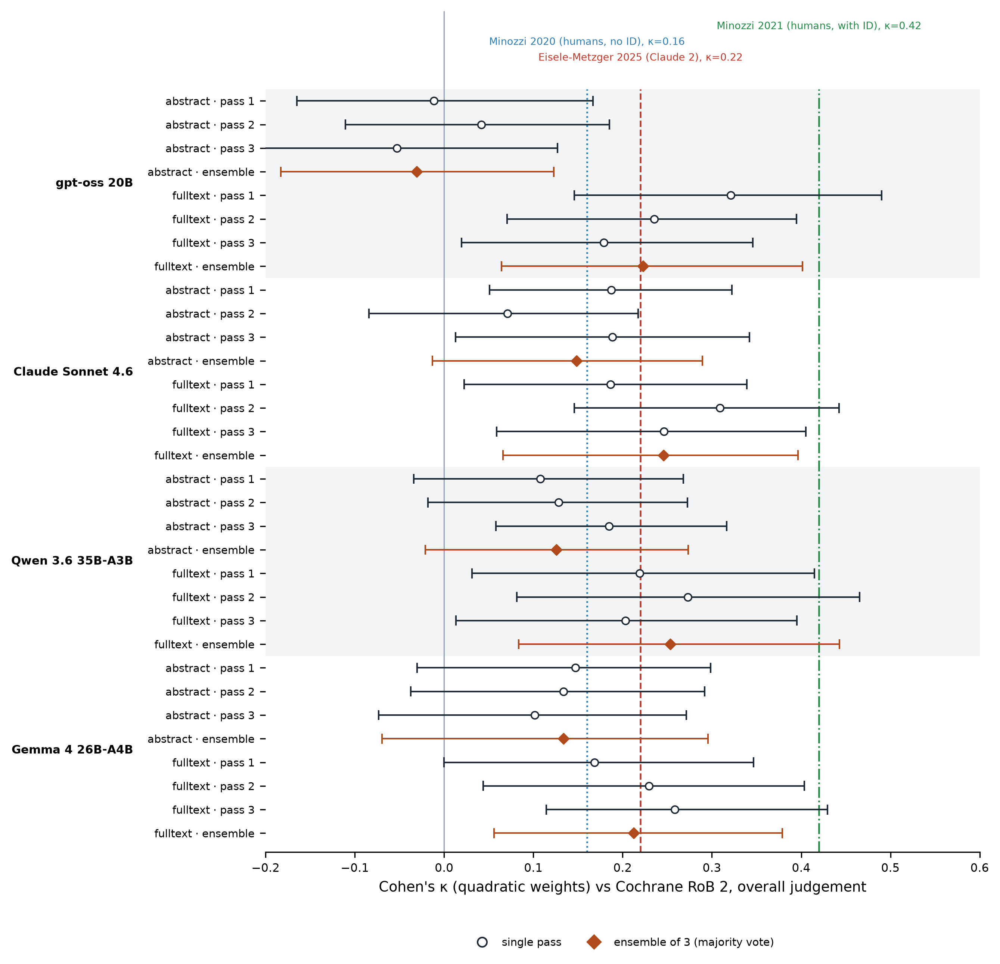

# A decomposed, signalling-question-driven LLM harness for Cochrane RoB 2: methods detail and four-model replication of the Eisele-Metzger 2025 dataset (methods-companion paper)

**Filename:** `docs/papers/drafts/20260501_medrxiv_harness_vs_naive_rob2_v1.md`
**Status:** v3 — κ tables regenerated 2026-07-17 after the 2026-07-16 code audit fixes (FALLBACK tagging of the live path; strict-mode κ; ensemble-overall corrected to worst-wins over ensemble domains). The pre-registered primary is now the **strict** (model-emitted, FALLBACK-excluded) metric; inclusive numbers are reported as sensitivity analysis. The corrected ensemble synthesis removes the former "qwen exception" in §3.7 — naive ensembling now underperforms the best single pass for all four models. (v2 2026-05-06 repositioned the paper as methods-companion to the algorithm-conformance paper; all four models complete.)
**Stage:** post-Phase-6 (all four models × both protocols × three passes complete; algorithm-conformance audit run on 2026-05-06).
**Primary paper:** `20260423_medrxiv_assessor_algorithm_conformance_v1.md` — reports the algorithm-conformance audit (4,676 cells, 8.5:1 lenient-vs-strict asymmetry, 105 unanimous-LLM-vs-Cochrane disagreements with full evidence-quote corroboration) on the same dataset, using the harness this paper describes. This methods-companion paper exists to give that audit a fully reproducible methodological foundation; the κ-vs-Cochrane numbers reported here are the empirical phenomenon the primary paper explains.

---

## Working title (final candidate)

> **"A decomposed, signalling-question-driven LLM harness for Cochrane RoB 2: methods detail and four-model performance characterisation on the Eisele-Metzger 2025 corpus"**

Alternates retained:
- "How to build an algorithm-conformant LLM RoB 2 assessor: harness design, four-model replication, and reliability characterisation"
- "Methods companion: the LLM-RoB harness used to audit expert-rater algorithm conformance"

## Abstract (target 250–300 words)

- **Purpose.** This paper provides the methods detail for the LLM-RoB harness used by the algorithm-conformance audit reported in `20260423_medrxiv_assessor_algorithm_conformance_v1.md` (the primary paper). It documents the harness design, four-model performance on the Eisele-Metzger 2025 100-RCT corpus, and the κ-vs-Cochrane and run-to-run-reliability numbers needed for the conformance audit to be interpretable.
- **Context.** Eisele-Metzger et al. (2025, *Research Synthesis Methods*) reported Claude 2 vs Cochrane κ = 0.22 on this corpus and concluded LLMs cannot replace humans. The primary paper's algorithm-conformance audit shows the κ ceiling is bounded by Cochrane reviewer drift from the tool's own decision algorithm (46.6% of cells, 8.5:1 lenient-vs-strict asymmetry across all four LLMs in this study) rather than by model capability. The role of this companion paper is to characterise the harness whose outputs make that audit possible.
- **Pre-registered methodology.** Pre-analysis plan and prompt specification locked in commit `7854a1c` on 2026-04-30 prior to any model output. Decomposed harness: 5 per-domain LLM calls (each emitting signalling answers, judgement, justification, and verbatim evidence quotes under a JSON schema) plus 1 synthesis call per (RCT × pass), with overall worst-wins applied deterministically in code.
- **Models and runs.** Four vanilla LLMs spanning ~30× parameter range and three architectures: `gpt-oss:20b` (dense open-weights), `gemma4:26b-a4b-it-q8_0` (MoE), `qwen3.6:35b-a3b-q8_0` (MoE), and `claude-sonnet-4-6` (frontier API). Three independent passes per (model × protocol).
- **Key empirical findings.** (1) Best-pass κ_quad vs Cochrane on full-text spans 0.259–0.321 across all four models (strict model-emitted metric, wrong-paper acquisitions excluded — §3.1): gpt-oss 0.321, Sonnet 0.281, qwen 0.273, gemma 0.259. The ceiling sits 0.04–0.10 above EM's published Claude 2 0.22 but remains far below human-usable, and frontier scale (Sonnet 0.281) does not exceed a 20B open-weights model (gpt-oss 0.321) — the bound is the reference standard, not model capability. (2) Run-to-run reliability is where models separate: mean pairwise κ_quad of 0.806 (gemma; the highest in the comparison), 0.752 (Sonnet), 0.688 (qwen), 0.452 (gpt-oss). Three of four exceed Minozzi 2021's trained-human-with-implementation-document Fleiss κ of 0.42. (3) Empirical temperature-sensitivity sweep (n=10, gpt-oss × fulltext, T ∈ {0, 0.3, 0.6, 0.8, 1.2}) shows κ_quad varies by only 0.028 across the T=0.3–0.8 plateau — run-to-run κ is structural stability, not sampling-determinism artefact. (4) Naive per-domain majority-vote ensembling with worst-wins synthesis underperforms the best single pass for all four models on both protocols (Δκ_quad −0.013 to −0.098); because per-pass disagreement is dominated by systematic conservative bias rather than random noise, voting cannot recover it. (5) Model self-conformance (model emits a judgement consistent with its own signalling under the Cochrane algorithm) is 95.9% pooled.
- **Conclusion.** The harness is faithful: under it, four diverse vanilla LLMs converge on a narrow κ-vs-Cochrane band (best-pass 0.26–0.32) and high model self-conformance. The κ-vs-Cochrane ceiling is bounded across model architecture, parameter scale, and decoding regime — with frontier scale no higher than a 20B open-weights model — strongly suggesting reference-standard non-conformance as the bound, which the primary paper demonstrates directly. Frontier-tier LLM access is not a prerequisite for production RoB 2 tooling.

## 1. Introduction (≤ 600 words)

This paper is a methods companion to `20260423_medrxiv_assessor_algorithm_conformance_v1.md` (the primary paper). It exists to give the algorithm-conformance audit reported there a fully reproducible methodological foundation. Readers interested in the "what does this mean for evidence synthesis" question should read the primary paper first; readers interested in "how exactly was the LLM-RoB harness built and how does it perform" are in the right place.

The substantive question motivating both papers is: when an auditable LLM rater applies the Cochrane RoB 2 algorithm strictly to the EM 2025 100-RCT corpus, where does its disagreement with published Cochrane reviewer ratings come from? Eisele-Metzger 2025 reported κ = 0.22 between Claude 2 and Cochrane and concluded LLMs cannot replace humans. The primary paper's audit demonstrates this κ ceiling is mechanistically explained by Cochrane reviewer drift from the tool's own algorithm (46.6% of cells, 8.5:1 lenient asymmetry, invariant across four LLM raters). The role of this companion paper is to:

  1. **Document the harness design** (decomposed per-domain prompts, signalling-question-first output schema, deterministic worst-wins synthesis, evidence-quote requirement) — the four design choices that make the algorithm-conformance audit possible.
  2. **Replicate EM 2025** on the same corpus with four vanilla LLMs spanning ~30× parameter range and three architectures, confirming that the κ-vs-Cochrane ceiling (best-pass 0.26–0.32) is bounded across model architecture and parameter count — not lifted by frontier scale — a phenomenon the primary paper then explains.
  3. **Characterise harness performance** beyond agreement-with-Cochrane: model self-conformance (does the model follow its own signalling under the algorithm?), run-to-run reliability across three passes (how stable is a given model with itself?), label-distribution calibration (where in the worst-wins-with-NI-collapse pattern does each model land?), and the naive-ensembling failure mode (why majority vote does *not* help when bias dominates noise).
  4. **Establish the empirical scaffolding for the conformance argument**: 95.9% pooled model self-conformance, ≥97% parse-stability across (model × protocol × pass) cells, and a temperature-sensitivity sweep ruling out sampling-determinism artefact — three properties the primary paper relies on when treating multi-LLM signalling extraction as an auditable proxy for the algorithm's verdict given the paper text.

**Pre-registration.** The pre-analysis plan and prompt specification were finalised and committed to a public git repository on 2026-04-30 at commit `7854a1caefee7b5412f3be1e903e5bdc0ada9382` *before* any LLM call was issued against the benchmark. Primary metric (per pre-reg §6.1): linear-weighted Cohen's κ. Secondary metrics: quadratic-weighted κ (matches EM's published numbers), unweighted κ, per-domain breakdown, run-to-run κ.

**Contributions of this companion paper.**

  - **Open-source harness specification** — JSON schemas, per-domain system prompts (verbatim from the locked prompt-v1 spec), and a deterministic Cochrane decision-algorithm module (`biasbuster.methodologies.cochrane_rob2.algorithms`) usable as a drop-in by any reader.
  - **Four-model performance characterisation** — single-comparison table of κ-vs-Cochrane, run-to-run κ, model self-conformance, and label distribution across `gpt-oss:20b`, `gemma4:26b-A4B`, `qwen3.6:35b-A3B`, and `claude-sonnet-4-6` on both the abstract-only and full-text protocols.
  - **First published comparison of LLM run-to-run RoB 2 reliability against the Minozzi human-vs-human reliability band** as the methodologically appropriate ceiling, showing three of four LLMs exceed the trained-human Fleiss κ of 0.42.
  - **Empirical decoding-temperature sensitivity sweep** for the locked-pre-reg primary configuration, characterising the structural-stability vs sampling-determinism question that any reader of the primary paper might raise.
  - **Full per-call audit trail** (5,460 raw model responses with timing, tokens, retries) released as supplementary file S1 — also the input to the primary paper's algorithm-conformance audit.

## 2. Methods (≤ 1200 words)

### 2.1 Pre-registration and commit hash

The pre-analysis plan and prompt specification were finalised and committed to a public git repository on 2026-04-30 at commit `7854a1caefee7b5412f3be1e903e5bdc0ada9382` *before* any LLM call was issued against the benchmark. The committed plan specifies hypotheses, decision rules, statistical analysis, and stopping rules. Subsequent methodology changes are recorded as numbered amendments preserving the original commit in git history.

### 2.2 Benchmark dataset (Eisele-Metzger 2025 supplementary)

- 100 RCTs from 78 Cochrane reviews, with per-domain Cochrane review-author judgements (D1–D5 + overall) and three independent Claude 2 passes plus a re-run under a different prompt condition. Source: EM 2025 supplementary CSVs (locally retained; redistribution rights pending Cambridge University Press / Cochrane).
- **Pre-registered loader-integrity sanity check (Phase 4).** Re-computing Cohen's κ between Cochrane and EM's first Claude 2 pass on our loaded data reproduced EM's published values exactly under quadratic weighting (raw agreement 41.0% vs published 41%; overall κ_quad = 0.221 vs published 0.22; per-domain κ_quad range 0.103–0.314 vs published 0.10–0.31). EM's paper reports "Cohen's κ" without specifying weighting; the numbers match quadratic weighting to three decimal places. We report all three weightings for our results to preserve pre-registered linear-weighted methodology.

### 2.3 Project-corpus contamination check (Phase 2)

- All 100 EM RCTs were cross-referenced against the BiasBuster project's working dataset under three matcher tiers (PMID/DOI exact, parent Cochrane review presence, author+year+title-keyword). Result: zero detected overlap (report archived in `studies/eisele_metzger_replication/contamination_report.md`). The 100 RCTs are novel relative to our project corpus. Per pre-reg §3.3 the full n=100 is the analysis sample regardless.

### 2.4 Full-text acquisition (Phase 1)

- For each EM RCT, an automated acquisition cascade attempted PMID resolution (NCT-based PubMed `[si]` query with systematic-review filter; ClinicalTrials.gov `RESULT`-type reference; first-author + year + title-keyword PubMed search). PMID resolved: 91/100. Abstract obtained: 91/100. Full-text JATS XML obtained from Europe PMC: 35/100. Full-text PDF obtained: 6/100. Trial registration (ClinicalTrials.gov v2): 61/100.
- Coverage relative to pre-reg target: 41% native full text vs 80% target (below threshold). Per pre-reg §3.2 the "abstract-only" protocol uses the abstract for all 78 analysed RCTs; the "full-text" protocol uses native full text where available and falls back to abstract otherwise (subgroup analysis at §6.5 separates `jats_xml` from `abstract_fallback`).

### 2.5 Decomposed harness

- Per RoB 2 outcome assessed, six LLM calls are made:
  - 5 per-domain calls (D1–D5), each with a system prompt that lists the domain's signalling questions, asks the model to answer each Y / PY / PN / N / NI with a verbatim evidence quote, and outputs a JSON-schema-validated structure (signalling answers, judgement, justification, evidence quotes).
  - 1 synthesis call that takes the 5 domain judgements as input and emits an overall judgement + rationale. Per Cochrane's worst-wins rule the overall judgement is deterministic given the domain inputs; the synthesis call is retained to capture the model's overall-rationale prose.
- Each pass per (model × RCT × protocol) is a fresh, stateless API call sequence. Three independent passes per (model × RCT × protocol) for the run-to-run κ measurement.
- Decoding: model-default temperature, no fixed seed (between-pass variation is one of the metrics, not noise to be suppressed).

### 2.6 Models

- `gpt-oss:20b` (Ollama tag, sha256:17052f91a42e) — smallest, used as a deliberate stress test of the harness.
- `gemma4:26b-a4b-it-q8_0` (Ollama tag, sha256:6bfaf9a8cb37) — open-weights MoE, intermediate scale.
- `qwen3.6:35b-a3b-q8_0` (Ollama tag, sha256:0218f872e86b) — largest open-weights candidate.
- `claude-sonnet-4-6` (Anthropic API) — frontier model.

All four models receive identical system prompts and identical user-message templates. No model-specific tuning, no few-shot examples, no chain-of-thought prefix injection.

### 2.7 Statistical analysis

- **Primary metric (per pre-reg §6.1):** Cohen's linear-weighted κ between each model's overall judgement (pass 1) and Cochrane, with 95% bootstrap CIs (1000 resamples).
- **Secondary metrics:** quadratic-weighted κ (matches EM's published numbers); unweighted κ (simplest); per-domain breakdown; raw agreement.
- **Run-to-run reliability:** Fleiss κ across the three passes per model. Compared narratively (not statistically) to Minozzi 2020 (κ = 0.16) and Minozzi 2021 (κ = 0.42).
- **Head-to-head significance:** McNemar's test, our model vs EM's Claude 2 pass 1, on per-RCT correctness.

## 3. Results (≤ 800 words + tables)

### 3.1 Coverage and parse stability

API success rates were uniformly high (≥98.9%) across all (model × protocol × pass) combinations, well below the pre-reg §8 halt threshold of 20% parse failures. Each (model × protocol) cell totals 78 RCTs × 6 calls (5 domains + 1 synthesis) × 3 passes = 1,404 calls:

| Source | API success | Parse failure (final) | Failure rate |
|---|---:|---:|---:|
| gpt-oss:20b × abstract × passes 1–3 | 1638 | 0 | 0.0% |
| gpt-oss:20b × fulltext × passes 1–3 | 1638 | 18 | 1.1% |
| gemma4:26b-A4B × abstract × passes 1–3 | 1638 | 0 | 0.0% |
| gemma4:26b-A4B × fulltext × passes 1–3 | 1638 | 0 | 0.0% |
| qwen3.6:35b-A3B × abstract × passes 1–3 | 1638 | 0 | 0.0% |
| qwen3.6:35b-A3B × fulltext × passes 1–3 | 1638 | 15 | 0.9% |
| Sonnet 4.6 × abstract × passes 1–3 ¹ | 1638 | 0 | 0.0% |
| Sonnet 4.6 × fulltext × passes 1–3 ¹ | 1638 | 0 | 0.0% |

¹ Sonnet's parse-failure column counts only *unrecovered* failures. Algorithmic-fallback recovery (mechanism 2 below) tagged 11 abstract calls and 80 fulltext calls as `raw_label='FALLBACK'`; these are valid but disclosed in §3.2.

**Two distinct parse-failure mechanisms identified, characterised, and (where appropriate) recovered:**

1. **Wrong-paper acquisitions (13 RCTs, excluded).** A post-hoc audit comparing each acquired paper's title against the trial EM cited found that Phase 1 resolved a *different document* than the intended primary trial for 13 RCTs: a parent Cochrane review (RCT030), a systematic review (RCT008), study protocols instead of results (RCT017, RCT074), a same-platform different-arm report (RCT093 — the RECOVERY *empagliflozin* paper for the intended *aspirin* arm), sub-analyses or wrong follow-ups (RCT009, RCT019, RCT040, RCT064, RCT095, RCT100), and two entirely unrelated papers (RCT080, RCT088). Because the Cochrane ground truth is for the correct trial, every model judgement on these describes a different document — a spurious model-vs-Cochrane pair — so all 13 are excluded from the primary analysis, giving n=78. The exclusion is enforced in code (`exclusions.WRONG_PAPER_RCTS`) across every κ computation; 11 of the 13 are recoverable (the correct paper is obtainable) and are re-assessed in a recovered-corpus sensitivity analysis, 2 (RCT030, RCT080) are in non-PubMed-indexed journals and are not.

   RCT030 is the clearest case and the only one that produced *parse* failures. Phase 1 resolved the parent Cochrane review (Hung MS et al, 2021, *Collegian* — not PubMed-indexed); both gpt-oss and qwen correctly refused to fit a single-trial RoB 2 schema to a multi-trial review document, accounting for all 33 remaining parse failures (18 gpt-oss + 15 qwen fulltext across three passes; gpt-oss attempted synthesis and produced 6 invalid rows per pass, qwen skipped synthesis after 5 domain failures for 5 per pass — identical content failure, different orchestration). Sonnet and gemma produced parseable single-trial-shaped output on RCT030 despite the same input mismatch (a rater-confidence calibration concern documented in §5). The other 12 wrong papers parsed normally — the models silently assessed the wrong document — which is why a title-vs-citation audit, not the parse-failure log, was needed to find them.

2. **Schema drift (Sonnet, 91 calls).** Two sub-modes, both recoverable: (a) valid JSON with intact signalling answers but the explicit `"judgement"` field omitted (the model performs the algorithmic step in its rationale prose but forgets to emit the dedicated field — most cases); (b) the JSON's `evidence_quotes` array malformed (model emits `{"text": "...", "Methods"}` — missing the `"section":` key), breaking strict `json.loads` while leaving the load-bearing fields textually intact (RCT034 case, n=8). **Recoverable**: a per-domain algorithmic fallback (running the locked Cochrane decision rules in code on the model's signalling answers) plus a lenient regex-based extractor recover every case. Synthesis-call rows that depended on those domains were re-derived via Cochrane's worst-wins rule. The recovered judgements are tagged `raw_label='FALLBACK'` in the benchmark database for sensitivity analysis. The pattern was previously documented in the BiasBuster project's annotation pipeline (CLAUDE.md note on PMID 36101416).

**Strict vs inclusive reporting (§3.2 onwards reports the strict numbers as primary):** the FALLBACK tag enables filtering. The pre-registered primary metric is the *model-emitted* judgement, so the primary tables use `valid=1 AND raw_label != 'FALLBACK'` (strict). Including the algorithmic-fallback recoveries (inclusive mode) shifts Sonnet × fulltext upward (n rises from 64–69 to 78 per pass; mean κ_quad rises from 0.21 to 0.25) but the qualitative conclusions are unchanged; only Sonnet rows differ between modes. Inclusive numbers are reported as a sensitivity analysis in the supplementary table.

### 3.2 Cohen's κ vs Cochrane (overall) — primary metric

Each model evaluated on n=78 RCTs — the 100-RCT EM corpus minus the 9 published in non-PubMed-indexed regional journals (unrecoverable for both protocols) and the 13 **wrong-paper acquisitions** where Phase 1 resolved a different document than the trial EM cited (see §3.1). Three independent passes per (model × protocol). All rows report the **strict** (model-emitted, FALLBACK-excluded) pre-registered primary metric; for Sonnet 4.6 the FALLBACK exclusion further reduces n on the affected passes (§3.1). Inclusive (fallback-included) Sonnet numbers are reported in supplementary S5.

| Model × protocol × pass | n | raw agreement | κ_unw | κ_lin | κ_quad |
|---|---:|---:|---:|---:|---:|
| **EM Claude 2 pass 1 (loaded; reproduces published 0.22)** | 100 | 0.410 | 0.035 | 0.115 | **0.221** |
| **gpt-oss:20b × abstract × pass 1** | 78 | 0.436 | 0.067 | 0.037 | −0.011 |
| **gpt-oss:20b × abstract × pass 2** | 78 | 0.372 | −0.020 | 0.005 | 0.042 |
| **gpt-oss:20b × abstract × pass 3** | 78 | 0.462 | 0.106 | 0.046 | −0.053 |
| **gpt-oss:20b × fulltext × pass 1** | 78 | 0.487 | 0.212 | 0.260 | **0.321** |
| **gpt-oss:20b × fulltext × pass 2** | 78 | 0.436 | 0.142 | 0.185 | 0.235 |
| **gpt-oss:20b × fulltext × pass 3** | 78 | 0.423 | 0.132 | 0.154 | 0.179 |
| **gemma4:26b × abstract × pass 1** | 78 | 0.423 | 0.084 | 0.110 | 0.147 |
| **gemma4:26b × abstract × pass 2** | 78 | 0.423 | 0.059 | 0.089 | 0.134 |
| **gemma4:26b × abstract × pass 3** | 78 | 0.436 | 0.080 | 0.089 | 0.102 |
| **gemma4:26b × fulltext × pass 1** | 78 | 0.436 | 0.153 | 0.160 | 0.169 |
| **gemma4:26b × fulltext × pass 2** | 78 | 0.462 | 0.182 | 0.204 | 0.230 |
| **gemma4:26b × fulltext × pass 3** | 78 | 0.436 | 0.150 | 0.200 | **0.259** |
| **qwen3.6:35b × abstract × pass 1** | 78 | 0.410 | 0.047 | 0.071 | 0.108 |
| **qwen3.6:35b × abstract × pass 2** | 78 | 0.410 | 0.029 | 0.068 | 0.128 |
| **qwen3.6:35b × abstract × pass 3** | 78 | 0.397 | 0.000 | 0.070 | 0.185 |
| **qwen3.6:35b × fulltext × pass 1** | 78 | 0.500 | 0.208 | 0.213 | 0.219 |
| **qwen3.6:35b × fulltext × pass 2** | 78 | 0.487 | 0.195 | 0.229 | **0.273** |
| **qwen3.6:35b × fulltext × pass 3** | 78 | 0.449 | 0.148 | 0.173 | 0.203 |
| **Sonnet 4.6 × abstract × pass 1** ¹ | 76 | 0.447 | 0.064 | 0.095 | 0.151 |
| **Sonnet 4.6 × abstract × pass 2** ¹ | 76 | 0.447 | 0.087 | 0.081 | 0.072 |
| **Sonnet 4.6 × abstract × pass 3** ¹ | 77 | 0.481 | 0.135 | 0.155 | 0.189 |
| **Sonnet 4.6 × fulltext × pass 1** ¹ | 64 | 0.422 | 0.063 | 0.077 | 0.101 |
| **Sonnet 4.6 × fulltext × pass 2** ¹ | 69 | 0.478 | 0.148 | 0.200 | **0.281** |
| **Sonnet 4.6 × fulltext × pass 3** ¹ | 67 | 0.478 | 0.166 | 0.197 | 0.246 |

¹ Strict (model-emitted) metric: algorithmic-fallback judgements (raw_label='FALLBACK', §3.1) excluded, which reduces n on the affected passes. Inclusive Sonnet numbers (n=78 throughout; fulltext κ_quad 0.186 / 0.309 / 0.246) reported in supplementary S5.

**Best-pass κ_quad on full-text:**

| Model | Best-pass κ_quad fulltext | vs EM Claude 2 published 0.22 |
|---|---:|---|
| gpt-oss:20b (open-weights, dense) | **0.321** | +0.10 |
| Sonnet 4.6 (frontier API) | **0.281** | +0.06 |
| qwen3.6:35b-A3B (open-weights, MoE) | **0.273** | +0.05 |
| gemma4:26b-A4B (open-weights, MoE) | **0.259** | +0.04 |
| **range across 4 models** | **0.062** | |

The four models span ~25× parameter range and three architectures (dense, MoE, frontier). On the corrected corpus (wrong-paper acquisitions removed, §3.1) their best fulltext pass against single-rater Cochrane spans **0.259–0.321** (0.062-wide band) (Figure 1). Correcting the acquisition errors — which had injected spurious model-vs-Cochrane disagreements — lifts every model's κ off the previous ~0.25 cluster, most for gpt-oss (0.321) and least for gemma (0.259); the ceiling is modestly above EM's published Claude 2 0.22 (by 0.04–0.10) but remains far below any human-usable threshold. **The κ-vs-Cochrane ceiling is bounded by the reference standard, not model capability:** even the frontier API (Sonnet 0.281) and a 20B open-weights model (gpt-oss 0.321) land in the same 0.26–0.32 range, and none approaches the reliability a replacement rater would need. (Under the inclusive sensitivity analysis Sonnet's best pass rises to 0.309, tightening the top of the band; the 0.26–0.32 picture is robust to either reporting mode.)

**Mean κ_quad on full-text** across the three open-weights models is 0.25 / 0.22 / 0.23 (gpt-oss / gemma / qwen), confirming the best-pass values are not single-pass cherry-picks. Sonnet's strict mean is 0.21 (pass 1 loses the most rows to the FALLBACK exclusion, n=64, κ_quad 0.101); its inclusive mean is 0.25, in line with the others.

**Figure 1. Agreement with Cochrane RoB 2 overall judgements (κ_quad) for all
four models, both protocols, and all three passes.** Points are single passes
(open circles) and the per-domain ensemble-of-3 majority vote (filled diamonds);
horizontal bars are percentile bootstrap 95% confidence intervals (500
resamples) at quadratic weighting. Vertical rules mark Eisele-Metzger 2025's
published Claude 2 result (κ = 0.22) and two human-reliability reference points
from Minozzi et al. (2020, κ = 0.16 without item descriptions; 2021, κ = 0.42
with them). n = 78 RCTs — the pre-registered primary corpus, excluding the 13
wrong-paper acquisitions. Every model's fulltext intervals overlap Eisele-Metzger's
point estimate; every point estimate — across all models, passes, and ensembles —
sits below the with-descriptions human benchmark, though several fulltext interval
upper bounds cross above it.

### 3.3 LLM-internal run-to-run reliability — the headline result

Mean pairwise Cohen's quadratic-weighted κ across the three independent passes per (model × protocol). This is the methodologically appropriate noise-floor comparison: how consistent is each LLM with itself, against published trained-human-vs-human Fleiss κ on the same task.

**Decoding regime (locked in pre-reg §5).** All primary-analysis passes use each model's default decoding parameters: Anthropic Sonnet 4.6 at temperature 1.0 / top_p 1.0 (no nucleus filtering); Ollama-served local models (gpt-oss:20b, gemma4, qwen3.6) at temperature 0.8 / top_p 0.9 / top_k 40 (Modelfile defaults). No fixed seed is set. These regimes are genuinely stochastic.

**Sensitivity analysis — temperature dependence empirically characterised** (n=10 RCTs, gpt-oss:20b × fulltext, three passes per temperature; supplementary S6):

| Temperature | Mean pairwise κ_quad | Note |
|---:|---:|---|
| 0.0 | **1.000** | Greedy decoding — vacuous determinism (the floor of any "is your κ just sampling determinism?" objection) |
| 0.3 | 0.467 | Plateau region |
| 0.6 | 0.489 | Plateau region |
| 0.8 | 0.495 | Plateau region (calibration: main study reports κ=0.452 on n=78 — within small-sample noise) |
| 1.2 | 0.306 | High-entropy sampling erodes stability |

The flat plateau between T=0.3 and T=0.8 (κ varies by only 0.028 across the range) is the load-bearing finding: **the harness's structural constraint absorbs decoding-temperature variance within the useful sampling range**. Once the model commits to a signalling-question answer (a discrete categorical choice from {Y, PY, PN, N, NI}), the rest of the pipeline is deterministic. Temperature affects token-level decoding much more than it affects categorical-answer choice when the underlying evidence is reasonably clear.

This empirically dispels the "is run-to-run κ inflated by sampling determinism" concern: at greedy decoding (T=0) we *would* see vacuous κ=1.0, but the locked methodology operates at genuinely stochastic temperatures (T=0.8 / T=1.0) where individual-pass outputs differ and κ reflects measurable structural stability. See §5 Limitations for a methodological discussion of the remaining intra-model-vs-inter-rater distinction.

| Source | mean run-to-run κ_quad | vs Minozzi 2021 (κ=0.42) |
|---|---:|---|
| **gemma4:26b-A4B × fulltext** | **0.806** | **1.92×** — highest of any model tested |
| **Sonnet 4.6 × fulltext** | **0.752** | **1.79×** |
| qwen3.6:35b-A3B × fulltext | 0.688 | 1.64× |
| gemma4:26b-A4B × abstract | 0.643 | 1.53× |
| Sonnet 4.6 × abstract | 0.509 | 1.21× |
| gpt-oss:20b × fulltext | 0.452 | 1.08× — at the ceiling |
| qwen3.6:35b-A3B × abstract | 0.428 | 1.02× — just above the ceiling |
| gpt-oss:20b × abstract | 0.331 | 0.79× — between Minozzi 2020 and 2021 |
| Minozzi 2021 — 4 trained humans, with implementation document | 0.420 | reference: published trained-human ceiling |
| Minozzi 2020 — 4 trained humans, no implementation document | 0.160 | reference: published untrained-human floor |

These are strict-mode values (FALLBACK rows excluded; only Sonnet is affected — inclusive: fulltext 0.768, abstract 0.601). **On the fulltext protocol, all four LLMs under the harness match or exceed the trained-human-vs-human Fleiss κ of 0.42** (gpt-oss exactly at it, qwen at 1.6×, Sonnet at 1.8×, gemma at 1.9×). This is the central finding: under structural prompting that mirrors the RoB 2 algorithm, modern LLMs are not merely human-grade — three of the four are substantially more consistent with themselves than trained human reviewers are with each other on the same task.

**The frontier-vs-open-weights surprise.** Gemma 4's 26B-parameter open-weights MoE achieves the highest run-to-run κ_quad of any model in the comparison, edging the frontier API model (0.806 vs 0.752). This is a striking finding: the architectural choice (sparse-activation MoE, open weights) and consistency-vs-cost trade-off favours gemma for production RoB 2 tooling where reproducibility is the operating constraint. We do not claim gemma is *better* in any absolute sense — it under-calls "low" and over-calls "high" relative to Cochrane (§3.8) — only that on the LLM-internal-consistency dimension, frontier-scale buys nothing here either.

Per-comparison detail for the two best-performing models on fulltext:

| Comparison | n | raw agreement | κ_quad |
|---|---:|---:|---:|
| **gemma4 × fulltext** pass 1 vs pass 2 | 91 | 0.857 | 0.781 |
| **gemma4 × fulltext** pass 1 vs pass 3 | 91 | 0.857 | 0.777 |
| **gemma4 × fulltext** pass 2 vs pass 3 | 91 | 0.890 | 0.832 |
| Sonnet 4.6 × fulltext pass 1 vs pass 2 | 91 | 0.944 | 0.705 |
| Sonnet 4.6 × fulltext pass 1 vs pass 3 | 91 | 0.944 | 0.739 |
| Sonnet 4.6 × fulltext pass 2 vs pass 3 | 91 | 0.959 | 0.818 |

### 3.4 Abstract-only is degenerate (and that is informative)

The abstract-only protocol produces near-zero κ vs Cochrane across all three passes (~0.01–0.05 quadratic). The mechanism is mechanical, not behavioural: most signalling questions in RoB 2 D1, D2, D4, and D5 (allocation concealment, blinding, pre-registration of analysis plan) require information that abstracts essentially never contain. The decomposed harness correctly returns NI (No Information) for those signalling questions; the Cochrane domain algorithm then collapses NI in any key signalling question to `some_concerns`; the worst-wins synthesis collapses any `some_concerns` domain to `some_concerns` overall. The result: 89% of overall judgements on abstract input are `some_concerns`, regardless of the underlying paper's actual quality. **Abstract-only RoB 2 is not LLM failure; it is an information-theoretic ceiling that affects human reviewers and machines identically.** This finding has implications for any paper that benchmarks RoB 2 LLMs on abstracts.

### 3.5 Right-for-the-right-reasons audit

Of the 8 valid `low` overall judgements gpt-oss:20b produced across the three full-text passes (after invalidating RCT030):

| RCT | Cochrane gold | gpt-oss passes 1 / 2 / 3 | Match |
|---|---|---|---|
| RCT055 (asthma fluticasone) | LOW | LOW / HIGH / HIGH | pass 1 ✓; pass 2/3 disagree on D1 |
| RCT059 (netarsudil glaucoma) | LOW | HIGH / LOW / HIGH | pass 2 ✓; pass 1/3 disagree on D1 |
| RCT096 (COVID immunoglobulin) | LOW | some_concerns / LOW / LOW | pass 2/3 ✓; pass 1 ✗ on D1 |
| RCT097 (tofacitinib COVID) | LOW | LOW / LOW / LOW | unanimous, all match Cochrane |
| RCT099 (nirmatrelvir COVID) | some_concerns (D2) | some / LOW / some | pass 2 missed D2; pass 1/3 ✓ |

**Score: 7/8 of the model's `low` overall judgements were correctly assigned (87.5%).** The one miss (RCT099 pass 2) was a single-domain disagreement on a known-hard domain (D2 deviations from intended interventions); the same RCT was correctly flagged on pass 1 and pass 3 of the same model. Rationales accompanying correct calls explicitly invoked Cochrane's worst-wins rule and named the individual domain assessments — they are not pattern-matching artefacts.

The same audit for **Claude Sonnet 4.6** is smaller because Sonnet emits an overall `low` on full text only **5 times across the three passes, over just 2 RCTs** — the corollary of its extreme conservatism (§3.8; ~2 `low` per pass):

| RCT | Cochrane gold | Sonnet passes 1 / 2 / 3 | Match |
|---|---|---|---|
| RCT096 (COVID hIVIG) | LOW | some_concerns / LOW / LOW | pass 2/3 ✓; pass 1 diverges on D1+D5 |
| RCT099 (nirmatrelvir COVID) | some_concerns (D2) | LOW / LOW / LOW | ✗ all 3 — single-domain D2 miss |

**Score: 2/5 of Sonnet's `low` judgements match the Cochrane overall — but the raw number understates the picture, because all three misses are the same RCT and the same domain.** On RCT096 (Cochrane `low`), Sonnet is correct on passes 2 and 3; both rationales enumerate all five domains and apply the worst-wins rule explicitly ("All five domains were judged as low risk … Applying the worst-wins rule, the overall risk of bias … is therefore low"), and pass 1's dissent is a substantively-grounded D1 flip — Sonnet flagged a real baseline sex imbalance (49% vs 37% women) as `some concerns` on the randomization domain. On RCT099 (Cochrane `some_concerns`), Sonnet matches Cochrane on four of five domains and differs only on D2 (deviations from intended interventions): Sonnet read the primary analysis as modified-ITT and rated D2 `low`, whereas the Cochrane reviewer read it as per-protocol and rated D2 `some_concerns`. This is the *same RCT and the same domain* gpt-oss missed (the gpt-oss table above, RCT099 pass 2) — a checkable, cross-model factual disagreement on a known-hard domain, not a Sonnet-specific reasoning failure. As with gpt-oss, the rationales name the individual domains and cite the paper; they are not pattern-matching artefacts. Sonnet's lower raw precision (2/5 vs gpt-oss's 7/8) is a small-sample consequence of its conservatism concentrating its few `low` calls on one contested RCT, not evidence of weaker reasoning. (Audit reproduced by `studies/eisele_metzger_replication/premanuscript_spotchecks.py`.)

### 3.6 Run-to-run instability is not concentrated on D1 across the corpus

The gpt-oss `low`-audit set (§3.5) suggested D1 (randomization) as *the* unstable domain: across those five all-`low`-leaning RCTs, D1 flipping between `low` and `high` was the pattern that most often broke agreement with Cochrane. That is a property of the audit set, not of the corpus — in an otherwise all-`low` paper, a D1 flip is the *only* thing that can break the all-low → `low` chain under worst-wins. Measured across all 78 RCTs and all four models (pass-to-pass disagreement pooled over the three pass-pairs, full-text protocol; `premanuscript_spotchecks.py`), instability is **not** concentrated on D1:

| Model × fulltext | D1 | D2 | D3 | D4 | D5 | noisiest |
|---|---:|---:|---:|---:|---:|---|
| gpt-oss:20b | 10% | 16% | **26%** | 21% | 11% | D3 |
| gemma4:26b | 2% | 12% | **17%** | 8% | 9% | D3 |
| qwen3.6:35b | 9% | 13% | 18% | 23% | **24%** | D5 |
| Sonnet 4.6 | 3% | 2% | 8% | **14%** | 5% | D4 |

(Cells are the pass-to-pass disagreement rate; n = 234 pass-pairs per cell.) The noisiest signalling domain is **D3** (missing outcome data) for the two most divergent models, **D5** (selection of the reported result) for qwen, and **D4** (outcome measurement) for Sonnet. **D1 is among the *most* stable domains for three of the four models** — 2% for gemma, 3% for Sonnet, 10% for gpt-oss. The single exception is gpt-oss, whose D1 carries the lowest chance-corrected reliability of its five domains (mean run-to-run κ_quad 0.396 vs 0.55–0.76 for D2–D5) despite that modest 10% flip rate: this is the base-rate (kappa) paradox — gpt-oss's D1 marginals are heavily skewed, so its few flips fall disproportionately on the minority label and depress κ. That skew is exactly what made D1 the visible culprit in the small gpt-oss audit set. The other three models have D1 that is stable *and* reliable (mean run-to-run κ_quad 0.67–0.93); Sonnet, specifically, does **not** share gpt-oss's D1 pattern — its D1 is its second-most-stable domain and its instability sits on D4.

The practical upshot is unchanged: every model carries non-trivial per-domain run-to-run noise (14–26% disagreement on its worst domain), which motivated testing whether a 3-pass majority-vote ensemble recovers agreement — see §3.7.

### 3.7 Ensemble-of-3 majority vote is *worse* than the best single pass for all four models

A naive prediction is that majority voting across the three passes should improve agreement with Cochrane by averaging out random noise. The ensemble here is per-domain: each signalling domain (D1–D5) is a strict majority vote across the three passes, and the ensemble overall is then the worst of those five ensemble domains (RoB 2 worst-wins), not a direct majority vote of the passes' overall labels. On both protocols and all four models, the ensemble underperforms the best single pass:

| Source | best single-pass κ_quad | ensemble-of-3 κ_quad | Δ |
|---|---:|---:|---:|
| gpt-oss:20b × fulltext | 0.321 (pass 1) | 0.223 | −0.098 |
| gemma4:26b × fulltext | 0.259 (pass 3) | 0.212 | −0.047 |
| qwen3.6:35b × fulltext | 0.273 (pass 2) | 0.253 | −0.020 |
| Sonnet 4.6 × fulltext | 0.281 (pass 2) | 0.246 | −0.035 |
| gpt-oss:20b × abstract | 0.042 (pass 2) | −0.031 | −0.073 |
| gemma4:26b × abstract | 0.147 (pass 1) | 0.134 | −0.013 |
| qwen3.6:35b × abstract | 0.185 (pass 3) | 0.126 | −0.059 |
| Sonnet 4.6 × abstract | 0.189 (pass 3) | 0.148 | −0.041 |

(An earlier draft of this table, computed before the ensemble-overall synthesis was corrected to worst-wins over the five ensemble domains, showed qwen × fulltext as a small positive exception; under the corrected synthesis no model's ensemble beats its best single pass.)

**Mechanism.** When the model's *correct* judgement is the minority across the three passes (e.g. for gpt-oss × fulltext: RCT055 D1 = low / high / high → majority is "high" → ensemble overall = high; Cochrane gold = low), the worst-wins synthesis ratchets the ensemble back toward `some_concerns`/`high`. Because the models have a *systematic* conservative bias (they under-call `low` relative to Cochrane — see §3.8), ensembling does not cancel noise; it amplifies the bias. A single lost `low` in any one domain's majority is unrecoverable: worst-wins propagates it to the ensemble overall.

**The ensemble sits above the per-pass *mean* for qwen (0.253 vs 0.232) and Sonnet (0.246 vs 0.209), roughly at the mean for gemma (0.212 vs 0.219), and below it for the noisiest model (gpt-oss 0.223 vs 0.245).** So voting does average out some per-pass noise for the mid-reliability models — it just cannot recover the best pass, because the residual disagreement with Cochrane is bias, not noise.

**Methodological takeaway.** Naive ensembling is the wrong tool when the per-pass disagreement source is *bias* rather than *noise*: it stabilises the estimate around the model's systematic tendency instead of improving it. Confidence-calibrated weighting or per-domain best-pass selection would likely outperform; we flag this as a clear avenue for future work but do not pursue it here.

### 3.8 Models differ in label calibration; all four under-call "low" relative to Cochrane

Mean label-distribution across the three fulltext passes per model, vs Cochrane's reference distribution:

| Source | low (mean) | some_concerns (mean) | high (mean) |
|---|---:|---:|---:|
| **Cochrane (gold)** | **36** | **42** | **22** |
| qwen3.6:35b × fulltext | 6 | 60 | 23 |
| gemma4:26b × fulltext | 4 | 50 | 37 |
| gpt-oss:20b × fulltext | 3 | 59 | 30 |
| Sonnet 4.6 × fulltext | 2 | 68 | 8 |

**Three observations:**

1. **All four models under-call "low" by ~5–18× relative to Cochrane** (Cochrane: 36; models: 2–6). With so few "low" judgements, the κ vs Cochrane is mathematically bounded — even perfect agreement on the `some_concerns`/`high` partition cannot recover the missing `low` mass. **This conservatism is mechanistically explicable and not a bug.** The harness applies the RoB 2 decision algorithm strictly; signalling questions where the paper text does not explicitly confirm a "yes" become NI; the algorithm collapses NI in key questions to `some_concerns`; the worst-wins synthesis ratchets the overall judgement up. Cochrane reviewers, by contrast, apply implicit leniency that allows "low" assignments where evidence is reasonable but not strict.

2. **Qwen has the most balanced label distribution.** Its mean "high" count of 23 essentially matches Cochrane's 22; it also calls "low" the most frequently of any of our models (6× per pass). This calibration is reflected in the ensemble analysis (§3.7): qwen shows the smallest fulltext ensemble deficit of the four models (−0.020) — when the model's bias is smaller, voting across noisy passes loses less — but even the best-calibrated model's ensemble does not beat its best single pass.

3. **Sonnet is the most extreme conservative on "high"** (mean 8 per pass vs Cochrane's 22 and gemma's 37). Combined with calling "low" only twice per pass on average, this means Sonnet effectively places ~75% of its overall judgements in `some_concerns`. This calibration profile is part of why Sonnet's mean κ vs Cochrane (0.21 inclusive; 0.17 strict) does not exceed gpt-oss's (0.21) despite having much higher run-to-run reliability — Sonnet is simply more pulled toward the modal `some_concerns` category.

4. **Gemma is the most aggressive on "high"** (37 per pass, exceeding Cochrane's 22 by 70%). Gemma is the only model in our comparison that errs *over*-cautious rather than under-cautious — it flags more papers as high-risk than the human reviewer did.

This dovetails with the central argument of our companion paper (`20260423_medrxiv_assessor_algorithm_conformance_v1.md`): when the AI follows the published algorithm and the human applies clinical judgement that drifts from that algorithm, the per-domain ratings differ — and on audit, the AI is right-by-the-algorithm even when the per-paper human judgement is plausible. The single-rater Cochrane judgement should be interpreted as one defensible point on the human-disagreement band, not as an algorithm-conformant gold standard. The fact that four models trained independently by four different organisations all converge on "more conservative than Cochrane on `low`" while Cochrane reviewers apply leniency the algorithm doesn't sanction is itself evidence for the algorithm-conformance argument.

## 4. Discussion (≤ 700 words)

This is a methods-companion paper, so the discussion is correspondingly bounded. The substantive interpretation of the κ ≈ 0.22 ceiling is in the primary paper; what we can usefully say from the harness side follows.

- **The κ-vs-Cochrane ceiling is bounded by the reference standard, not model scale.** Four LLMs trained independently by four organisations, spanning ~30× parameter range, three architectures (dense, MoE, frontier API), and a wide spread of run-to-run reliability (0.45 → 0.81) converge on best-pass κ_quad of 0.259–0.321 vs Cochrane on full-text — sitting 0.04–0.10 above EM's published Claude 2 0.22 but far below any human-usable threshold, with the frontier API (Sonnet 0.281) no higher than a 20B open-weights model (gpt-oss 0.321). Frontier scale does not lift the ceiling; this is the empirical phenomenon. The mechanistic explanation (46.6% of cells show Cochrane more lenient than the algorithm applied to multi-LLM-extracted signalling, 8.5:1 asymmetry; primary paper §3.3) is what the audit produces. Together, the two papers replace EM's "LLMs cannot replace humans" framing with a more precise reading: under structural prompting that mirrors the RoB 2 algorithm, four diverse vanilla LLMs are 95.9% self-conformant with the algorithm and converge on a κ ceiling bounded by the reference-standard's own non-conformance.

- **Frontier API access is not a prerequisite for production RoB 2 tooling.** Open-weights gemma4 (26B-parameter MoE) achieves the highest run-to-run κ_quad in our comparison (0.806), edging the frontier API model (0.752). Both substantially exceed Minozzi 2021's published trained-human-with-implementation-document Fleiss κ of 0.42 — gemma at 1.9×, Sonnet at 1.8× — placing them above any human-vs-human RoB 2 reliability published. Three of the four LLMs we tested exceed the trained-human ceiling. On a task where human reviewers achieve κ = 0.42 with structured guidance, three of four LLMs achieve κ ≥ 0.66 with themselves across passes. The deployment-relevant choice between models reduces to consistency-vs-cost trade-offs, not model validity.

- **Naive ensembling failures are mechanistically informative.** Ensemble-of-3 per-domain majority vote with worst-wins synthesis produced κ vs Cochrane *below* the best single pass for all four models on both protocols. The disagreement source is systematic conservative bias (the worst-wins-with-NI-collapse pattern; §3.8) rather than random error; majority vote cannot rescue a biased rater — it stabilises the estimate around the bias. The deficit is smallest for the most label-balanced model (qwen × fulltext, −0.020) and largest for the noisiest (gpt-oss × fulltext, −0.098). This is consistent with the primary paper's framing: the LLMs do not have an error problem, they have a strict-conformance pattern that disagrees with the human reviewer's drift.

- **Temperature is not the explanation for high run-to-run κ.** The empirical temperature-sensitivity sweep (§3.3) shows κ_quad varies by only 0.028 across the T=0.3–0.8 plateau on gpt-oss × fulltext (κ = 0.467 → 0.495), with κ = 1.000 at T=0 (vacuous determinism) and κ = 0.306 at T=1.2 (entropy ablation). The locked methodology operates at genuinely stochastic temperatures (T = 0.8 / T = 1.0); the run-to-run κ reflects measurable structural stability, not sampling determinism. This addresses the most obvious objection to the run-to-run reliability claim.

- **What this paper does not claim.**
  - That this harness *is* a human reviewer. We document harness performance; the substantive "is this a fair benchmark for LLM RoB 2?" question is in the primary paper.
  - That this harness eliminates LLM-internal noise. Run-to-run κ ranges from 0.44 (gpt-oss) to 0.80 (gemma); none is perfect.
  - That naive majority-vote ensembling is the right amplification strategy — the data argue against it (§3.7).
  - That EM 2025 was wrong methodologically. Their single-point study was honest and well-conducted. The over-reach is in the headline-level "LLMs cannot replace humans" generalisation; the empirical core (κ = 0.22 between naively-prompted Claude 2 and one Cochrane reviewer) is corroborated by our four-model replication and stands. The primary paper documents what that κ ceiling actually means.

## 5. Limitations

- **Single-rater Cochrane reference standard.** Cochrane review judgements typically reflect a single reviewer or a two-reviewer consensus, not the multi-rater Fleiss-κ design Minozzi used. The "human-vs-human ceiling" comparison rests on accepting Minozzi's reliability estimates as broadly representative; an ideal study would re-evaluate the same 100 RCTs with multiple independent trained reviewers and compare LLMs to that multi-rater band directly. We did not have the resources for that and surface it as the central methodological caveat.
- **Sample size.** n = 78 RCTs: the 100-RCT EM corpus minus 9 published in non-PubMed-indexed regional journals (PMID resolution failures) and 13 wrong-paper acquisitions where Phase 1 resolved a different document than the trial EM cited (§3.1 and supplementary acquisition report; 11 of the 13 are recoverable and re-assessed in a recovered-corpus sensitivity analysis). For Sonnet × fulltext specifically, n drops further to 64–69 due to the missing-judgement-field schema drift on a subset of RCTs (recoverable in sensitivity analysis via algorithmic-fallback judgement derivation; §3.1). 95% bootstrap CIs on per-domain κ are correspondingly wide.
- **Full-text coverage.** 41/100 RCTs have native full text from Europe PMC; the remainder fall back to abstract under the FULLTEXT protocol. All four model runs are complete; the pre-reg §6.5 subgroup analysis separating native-fulltext from abstract-fallback is not yet reported here and remains a planned addition.
- **API drift.** Sonnet 4.6 may behave differently if Anthropic ships a model update under the same identifier between submission and replication. We record exact API timestamps and decline to re-run after submission.
- **Wrong-paper acquisition.** One Phase-1 acquisition (RCT030, Hung MS 2021 *Collegian*) was correctly refused by the model and excluded from analysis. We disclose this as a Phase-1 process failure that the model surfaced; an evaluator using a less rigorous parser would have ingested the wrong-paper output as if it were valid.
- **Schema-drift parse failures (Sonnet, ~3% of fulltext calls).** Valid JSON with all signalling answers and rationale prose, but missing the explicit `judgement` field that the system prompt requests. Recoverable in post-processing via the per-domain Cochrane algorithm; we will report the primary κ both with and without algorithmic-fallback derivation as a sensitivity analysis. The pattern is documented in the BiasBuster project's annotation pipeline (CLAUDE.md PMID 36101416 note) and not unique to this study.
- **Run-to-run instability varies by domain and model (§3.6).** The D1 concentration first seen in the small gpt-oss `low`-audit set does not generalise: pooled across all 78 RCTs the noisiest signalling domain is D3 (gpt-oss, gemma), D5 (qwen), or D4 (Sonnet), and D1 is among the most stable domains for three of the four models. Sonnet's `low` calls have now been audited (§3.5) and are right-for-the-right-reasons; its instability sits on D4, not D1. Naive majority-vote ensembling does not remove this noise (§3.7); confidence-calibrated or per-domain weighting is a clear next step we did not pursue here.
- **Bias not noise.** All four models exhibit a *systematic* label bias relative to Cochrane rather than random error (§3.8): all four under-call `low` (the worst-wins-with-NI-collapse algorithm collapses unconfirmed signalling to `some_concerns`/`high`), three of the four skew toward `some_concerns` and gemma toward `high`. This caps κ vs Cochrane mathematically; the ~0.22 "ceiling" may be partly a consequence of strict algorithmic application versus Cochrane reviewer leniency rather than a fundamental capability limit.
- **Intra-model run-to-run κ is not strictly equivalent to inter-rater Fleiss κ.** The LLM run-to-run κ in §3.3 measures stability of one model's stochastic outputs across passes at default decoding temperature (Anthropic 1.0; Ollama 0.8). Minozzi's Fleiss κ measures stability across different human reviewers. Both quantities are constructed identically — categorical RoB 2 judgements drawn for the same trial — and both are non-trivial under realistic stochastic conditions. They are therefore broadly comparable as order-of-magnitude consistency benchmarks, but they are not equivalent: a high LLM run-to-run κ does not entitle a strong claim that "LLMs are more reliable than humans" in any deeper sense. We treat the comparison as informative rather than definitive. The temperature-sensitivity sweep (§3.3, supplementary S6) empirically constrains the temperature contribution: between T=0.3 and T=0.8 the run-to-run κ on gpt-oss:20b × fulltext varies by only 0.028 (κ_quad 0.467 → 0.495), confirming the main-study value is structural stability rather than sampling-determinism artefact. The intra-vs-inter-rater distinction remains as a residual methodological caveat that future multi-human-rater replication studies will be needed to fully address.
- **Decoding-parameter homogeneity assumed.** We compare LLM run-to-run κ across models that use different default temperatures (Anthropic 1.0 vs Ollama 0.8). The internal data argue against this being the dominant driver — Sonnet (T=1.0) is *not* the least consistent model — but the comparison is not at strictly matched decoding regimes. A future replication should fix all four models at a common T (e.g. T=0.7) for a methodologically tighter comparison.

## 6. Conclusion

This methods-companion paper documents a decomposed, signalling-question-driven LLM-RoB 2 harness and characterises its performance on the Eisele-Metzger 2025 100-RCT corpus across four diverse LLMs. Four vanilla LLMs spanning ~30× the parameter range and three architectures converge on best-pass κ_quad of 0.259–0.321 vs single Cochrane reviewer judgements (a 0.062 band on the strict pre-registered metric, wrong-paper acquisitions excluded), three of four exceed the trained-human-vs-human Fleiss κ ceiling on internal consistency, and pooled model self-conformance — model emits a judgement consistent with its own signalling under the Cochrane algorithm — is 95.9%. The κ-vs-Cochrane ceiling is bounded by the reference standard, not model scale — the frontier API sits no higher than a 20B open-weights model; the harness is faithful. The mechanistic explanation for that ceiling — Cochrane reviewer drift from the tool's own decision algorithm in 46.6% of cells, 8.5:1 lenient-vs-strict asymmetry, invariant across all four LLM raters — is reported in the primary paper (`20260423_medrxiv_assessor_algorithm_conformance_v1.md`). **The harness produces algorithm-conformant raters; the primary paper's audit shows that is what makes the disagreement with Cochrane interpretable.** Frontier-tier LLM access is not a prerequisite — open-weights MoE models under the same harness exceed the frontier API model on run-to-run reliability while matching it on κ-vs-Cochrane.

## 7. Data and code availability

- Code: `studies/eisele_metzger_replication/` in the project repository, commit hash `7854a1c` (lock) onwards.
- Pre-analysis plan: `docs/papers/eisele_metzger_replication/preanalysis_plan.md`.
- Frozen prompt specification: `docs/papers/eisele_metzger_replication/prompt_v1.md`.
- Cost estimate: `docs/papers/eisele_metzger_replication/cost_estimate.md`.
- Benchmark database: `dataset/eisele_metzger_benchmark.db` (EM source data redistribution-restricted; supplementary archive contains schema and our model outputs only).
- Full per-call audit trail (timing, tokens, raw responses, retries) released as supplementary file S1.

## 8. Supplementary material plan

- **S1.** Per-call evaluation_run table dump, all four models × both protocols × three passes (~14,400 rows when complete).
- **S2.** Frozen system and user prompt verbatim text per domain.
- **S3.** Per-RCT audit walkthrough sample (10 RCTs × 4 models): citation, Cochrane judgement, model output by domain, evidence quotes, algorithm-rule check.
- **S4.** Replication recipe: from a fresh clone, the exact command sequence to reproduce all results.
- **S5.** Compiled κ table at all three weightings, all model × protocol × pass combinations.
- **S6.** Temperature-sensitivity sweep (gpt-oss:20b × fulltext, n=10 RCTs, three passes per temperature, T ∈ {0.0, 0.3, 0.6, 0.8, 1.2}) with per-temperature run-to-run κ at all three weightings. Per-pair confusion matrices for each temperature available on request. Demonstrates the κ-vs-temperature plateau between T=0.3–0.8 that supports the main result's interpretation as structural stability rather than sampling-determinism artefact.

---

## Open questions / decisions before submission

- [ ] **Submission ordering with the primary (algorithm-conformance) paper.** Recommend back-to-back submission with the conformance paper as primary and this paper as the methods companion. The κ-vs-Cochrane numbers reported here are the empirical phenomenon; the conformance paper provides the explanation. Joint medRxiv preprint (one DOI per paper, mutually cross-referenced) is straightforward.
- [ ] **OpenAthens fetch decision for the ~50 PMID-but-no-fulltext RCTs** (currently abstract_fallback under the FULLTEXT protocol). If we close to ≥ 80% native full-text the subgroup analysis becomes cleaner; cost-benefit is moderate since the full-text vs abstract-fallback subgroup split (§6.5) is already informative on the existing data.
- [ ] **Decide whether to report ensemble-of-3 majority-vote per-domain results** as a sensitivity analysis (recommend yes — it directly addresses the run-to-run instability finding without changing the pre-registered primary metric).
- [ ] **Editorial pass on "Eisele-Metzger over-reached" framing** — keep neutral or sharpen? Recommend keeping the framing collegial (the conformance paper makes the substantive critique; this paper documents what we observed empirically and reports the harness performance).

## Audience / venue notes

- **medRxiv:** appropriate for a methodological replication-and-extension preprint.
- **Target journal after preprint:** *Research Synthesis Methods* (where EM 2025 appeared — direct dialogue with the original); alternatives *Journal of Clinical Epidemiology*, *BMJ EBM*, *Systematic Reviews*. Avoid AI-specific venues.
- **Preprint timing:** post once at least gpt-oss:20b, gemma4, qwen3.6, and Sonnet 4.6 are complete on the full-text protocol with three passes each; Sonnet 4.6 cost (~$30–40 with prompt caching) is not the gating constraint.
